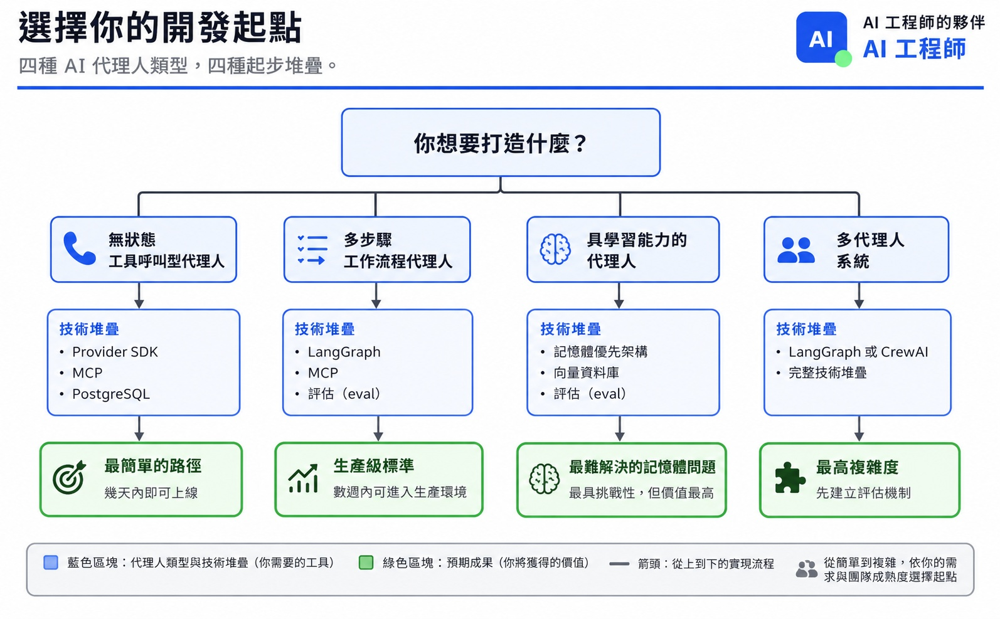
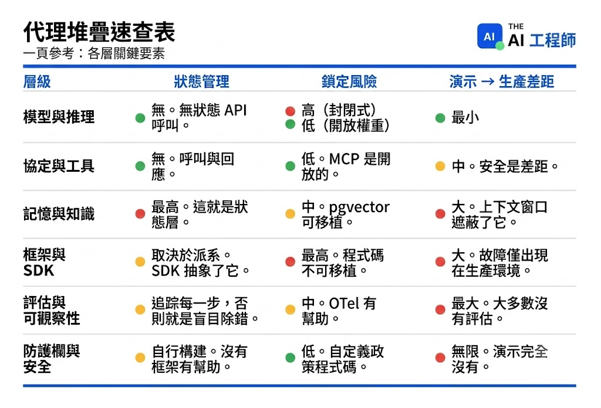

# 2026 AI Agent 技術堆疊

在你的 LLM 與生產級 agent 之間的六個層次

你的團隊為了一個客服聊天機器人選擇了 LangGraph。三週後，你已經有了一個包含 14 個節點的狀態圖（state graph）、一個寫入 Redis 的自訂 checkpointer，以及為了那些每週只失敗一次的工具呼叫所寫的重試邏輯。這個 agent 回答退款問題、呼叫一個 API。一個跑在 OpenAI SDK 上、搭配兩個 MCP server 的 50 行腳本就能做到同樣的事。但沒有人去釐清這個問題實際上需要哪些層次。

在 2024 年 11 月，Letta 發表了一張 [AI agents 技術堆疊圖](https://www.letta.com/blog/ai-agents-stack)，它成了我接觸過的工程團隊中、半數團隊的預設參考。如果你在 LinkedIn 上看過、或在 Slack 頻道中釘選過「agent 的各層次」視覺圖，它很可能就源自那篇文章。

那張圖現在已經 14 個月大了，而從那時起許多事情都改變了。當時 MCP 還不存在。記憶（memory）仍被視為向量資料庫的一個子集。沒有人在推出供應商原生（provider-native）的 agent SDK。評估（eval）甚至還沒被列入版圖。到了 2026 年，這個堆疊有六個層次，而且其中至少有三個在 Letta 畫出原始版本時，還不能算是獨立的類別。

所以我們從頭重畫了一次。這就是 2026 年版。

2026 年最小可行 Agent 技術棧

> 各層的預設工具、何時需要升級，以及自 2024 年以來的變化。

| 層級 | 從這裡開始 | 何時升級 | 自 2024 年以來的變化 |
|------|-----------|---------|-------------------|
| **模型服務** | Anthropic 或 OpenAI API | 當成本或延遲有要求時，改為自行託管 | 推理模型出現。開源模型與閉源模型的差距縮小。 |
| **協定與工具** | MCP | 不需要，它就是標準。 | 2024 年尚不存在。現已有 ~2,000 台伺服器，並進入 Linux 基金會。 |
| **記憶體與知識** | Postgres（pgvector）＋ 上下文內記憶 | 超過 1,000 萬筆向量時改用專用向量資料庫 | 記憶體從儲存層的子集，晉升為獨立層級。 |
| **框架** | Provider SDK（簡單）或 LangGraph（複雜） | 當你超出 SDK 的能力範圍時 | Provider SDK 正式進場。框架 vs. SDK 才是真正的問題。 |
| **評估與可觀測性** | Langfuse 或 Braintrust | 需要大規模自訂評估時 | 2024 年這一層根本不存在。 |
| **防護欄與安全** | NeMo Guardrails ＋ 自訂策略層 | 當 Agent 數量超過人工審查能力時 | Agent 防護欄 ≠ LLM 防護欄。這是一門新興學科。 |

---

**資料來源：** LangChain《Agent 工程現狀》報告（2025 年 12 月，1,340 位受訪者）、Anthropic MCP 公告（2025 年 12 月）、LangGraph 1.0 部落格（2025 年 10 月）。「從這裡開始」的選擇反映的是每一層摩擦最低的生產就緒選項，而非大規模場景下的最佳選項。

## 重點摘要

這就是起手式的堆疊。當某個特定環節出問題時才增加複雜度，而不是在那之前。

## 我們到底在繪製什麼？

在堆疊出現之前，先有一個迴圈。在〈[什麼是 AI Agent？](https://theaiengineer.substack.com/p/what-is-an-ai-agent)〉一文中，我們將 agent 定義為「思考—行動—觀察」（think-act-observe）循環：模型對任務進行推理、採取一個行動（呼叫工具、寫入記憶）、觀察結果，並反覆執行直到任務完成。那個迴圈是最基本的原子單位。本期內容中的一切，都是讓那個迴圈能在生產環境中、在規模化的情況下可靠運作的基礎設施。

Agent 堆疊不等於 LLM 堆疊。聊天機器人需要推論（inference），也許再加上 RAG。而 agent 需要跨多步驟執行的狀態管理、受協定治理的工具存取、能跨工作階段（session）持續存在的記憶、自主的推理迴圈，以及能即時約束行為的護欄（guardrails）。這是一組根本不同的基礎設施問題。

我們繪製的是介於你的 LLM 與生產級 agent 之間的六個層次。我們不涵蓋訓練基礎設施、資料管線（data pipeline），或模型微調（fine-tuning）。那些是相鄰的堆疊。我們在[第 5 期](https://theaiengineer.substack.com/p/what-is-rag-retrieval-augmented-generation)深入探討過 RAG。今天我們把視角拉遠，呈現 RAG 在更大藍圖中的位置。

在 2024 到 2026 年間，有三件事重新繪製了這張地圖。MCP 標準化了工具連接，整個工具層因它而全新誕生。推理模型（reasoning model）改變了 agent 能自主完成的事情，單次呼叫的 agent 取代了部分多步驟鏈（multistep chain）。而記憶成為一級（first-class）的架構基本元素，不再是事後拼接到向量資料庫上的附加物。

### 如何評估每一層

在每一層選擇工具時，要問三個問題。**你需要管理多少狀態（state）？** 一個無狀態的工具呼叫器，和一個會隨時間學習的多工作階段 agent，是不同的工程問題；而狀態管理最困難的層次（記憶、框架）正是大多數團隊卡關的地方。**你能容忍多少供應商鎖定（vendor lock-in）？** MCP 是開放標準，供應商 SDK 則不是，而你每一個工具選擇，都會增加或減少你下一次遷移的痛苦程度。**還有，從 demo 到生產有多難？** 有些層次（模型服務）幾乎沒有落差，而其他層次（評估、護欄）則有著巨大的落差。你最能感受到那道落差的層次，就是你該優先投資的層次。

我們由下而上逐層說明，從最穩定的開始，到最不成熟的結束。

## 第 1 層：模型與推論（Models and inference）

*你如何運行驅動 agent 的模型：呼叫 API、使用受管理的開放權重（open weight）供應商，或自行架設（self-host）。*

模型與推論：主要玩家

> 三種執行驅動你的 Agent 之模型的方式。

來源：[The AI Engineer](https://aiEngineer.com)

| **方式** | **主要玩家** | **最適合** |
|---|---|---|
| **封閉式 API** | OpenAI、Anthropic、Google | 最快上手，取得最新能力 |
| **開放權重 API** | Together AI、Fireworks、Groq | 較低成本，在託管基礎設施上運行開放模型 |
| **自行託管** | vLLM、SGLang、Ollama | 完全掌控，大規模下單位成本最低 |

推論層在語氣上的變化大於實質上的變化。像 o1、o3、DeepSeek R1，以及具備延伸思考（extended thinking）的 Claude 這類推理模型，改變了 agent 能規劃與執行的範圍。先前需要多步驟鏈的 agent，現在能在單次推理呼叫中解決問題。像 Llama 3.3、DeepSeek V3 與 Qwen 2.5 這類開放權重模型大幅縮小了品質差距，因此「永遠用最大的閉源模型」不再是預設的建議。新興的模式是：在閉源模型上做原型（prototype），在開放權重模型上做部署（deploy）。

> 老實說：這一層正在商品化（commoditizing）。模型之間的差異每一季都變得更不重要。真正的決策是成本與延遲（latency）的取捨，而不是哪個模型「最聰明」。

在評估面向上，API 呼叫是無狀態的。送出一個請求、得到一個回應，沒有東西需要管理。對閉源 API 而言鎖定風險很高，因為每個模型的推理方式不同，所以更換供應商就意味著要重新調校提示詞（prompt）、針對不同的失效模式做調整，並重新測試你的評估套件。對開放權重而言鎖定風險很低，你可以換掉模型而保留基礎設施。從原型到生產的落差是所有層次中最小的。你 demo 用的 API 呼叫，和你生產環境用的 API 呼叫是一樣的。

當你的 agent 呼叫量使得 API 計費難以負擔，或當你需要 API 來回傳輸（round-trip）無法達成的低於 100 毫秒延遲時，就自行架設。

## 第 2 層：協定與工具（Protocols and tools）

*你的 agent 如何呼叫外部工具與 API：透過 MCP server、瀏覽器自動化，或 agent 對 agent（agent-to-agent）協定。*

協定與工具：主要玩家

_你的 Agent 如何與外部世界連結。_

| **協定 / 工具** | **主要玩家** | **備註** |
|---|---|---|
| **MCP** | Agent 與工具的連接橋樑（通用標準） | 每月 SDK 下載量達 9,700 萬次以上。已加入 Linux 基金會。 |
| **Function Calling** | 特定供應商的工具呼叫 | 某些模式下仍有必要，但並非未來方向。 |
| **Browser Use** | 網頁自動化 Agent | GitHub 星數達 78K。2025–2026 年的爆發性新興類別。 |
| **ACP / A2A** | Agent 與 Agent 之間的溝通 | IBM（ACP）與 Google（A2A）主導。仍在發展中，尚未成為標準。 |

這一層在 2024 年還不是一個獨立的類別。當時每個框架都有自己定義工具用的 JSON schema。現在 MCP 成了標準，每月有 9,700 萬次的 SDK 下載量、獲得 OpenAI、Google 與 Microsoft 採用，並捐贈給了 Linux 基金會。

Browser Use 同步爆紅，在不到一年內衝上 7.8 萬個 GitHub star。2024 年沒有人在生產環境推出瀏覽器 agent。而現在 agent 能與其他 agent 對話。IBM 推出了 ACP，Google 推出了 A2A。兩者都還不是標準，但它們所解決的問題（agent 之間的協調）是真實且持續成長的。

安全性是尚未解決的問題。Endor Labs [分析了 2,614 個 MCP server](https://www.endorlabs.com/learn/classic-vulnerabilities-meet-ai-infrastructure-why-mcp-needs-appsec)，發現其中 82% 易受路徑遍歷（path traversal）攻擊、67% 易受程式碼注入（code injection）攻擊。

> 老實說：協定之爭已經結束。MCP 勝出了。剩下唯一的問題是：在有人利用漏洞之前，你要如何鎖緊你的 MCP server。

這裡的狀態管理是不存在的。你的 agent 呼叫一個工具、得到一個回應，結束。沒有工作階段、呼叫之間也沒有記憶。鎖定風險很低，因為 MCP 是開放標準，所以如果你建置 MCP server，任何相容於 MCP 的 agent 都能使用它們。從原型到生產的落差屬於中等。你 demo 用的 MCP server 能正常運作，直到有人送出一個惡意的工具描述為止。安全性與治理（governance）就是那道落差所在。

MCP 標準化了 agent 如何使用工具，但它對於 agent 之間如何對話隻字未提。ACP 與 A2A 正試圖解決這個問題，但兩者都尚未達到關鍵多數。如果你今天需要多 agent 協調，你得自己在框架層建置它。我們在[第 4 期](https://theaiengineer.substack.com/p/what-is-mcp)深入探討過 MCP。

## 第 3 層：記憶與知識（Memory and knowledge）

*你的 agent 如何儲存與取回它所知道的東西：脈絡內（in-context）狀態、向量搜尋，或跨工作階段持續存在的記憶。*

記憶體與知識：關鍵角色

三個層次的 Agent 記憶體，從最短暫到最持久。

| **層次** | **關鍵角色** | **最適合** |
|---|---|---|
| **上下文內記憶體** | Memory blocks、系統提示詞狀態 | Agent 每個回合讀寫的結構化狀態 |
| **外部召回** | pgvector、Pinecone、Qdrant、Neo4j GraphRAG | 按需檢索相關上下文（RAG） |
| **持久化學習狀態** | Mem0、Zep、Letta | 能跨 session 記住使用者與任務的 Agent |

這三個層級全都匯入同一個地方：你的 agent 在每次呼叫時所看到的脈絡視窗（context window）。

在 2024 年，記憶意味著「挑一個向量資料庫並做 RAG」。在 2026 年，記憶是一個具有三個不同層級的一級架構基本元素。脈絡視窗變得龐大。Gemini 達到超過 100 萬 token，Claude 達到 20 萬。更大的視窗並沒有消滅對記憶的需求，而是改變了取捨：什麼東西塞進脈絡內，什麼東西按需（on demand）取回？

「脈絡工程」（context engineering）取代「提示工程」（prompt engineering）成為核心學科。你不再是寫一個更好的提示詞，而是架構 agent 在每次呼叫時所看到的資訊。記憶區塊（memory block）以具名、結構化的欄位形式出現在脈絡視窗中，agent 可以在每一輪讀取並覆寫它們。agent 不再把所有東西都倒進系統提示（system prompt），而是管理自己的狀態：要保留什麼、要更新什麼、要捨棄什麼。

在基礎設施面，pgvector 成為那些不需要專用向量資料庫的團隊的預設選擇。它就只是裝了擴充套件的 Postgres。GraphRAG 作為第二種取回選項浮現：跟隨實體（entity）之間的關係，而非比對嵌入向量（embedding），這個領域由 Neo4j 領先。睡眠時運算（sleep-time compute），也就是 agent 在閒置時間處理資訊，目前還在研究階段，但它預示了第三層級的走向。

> 老實說：大多數團隊把記憶搞得太複雜了。先從 Postgres 中的對話歷史與一個結構化的系統提示開始。當你的歷史紀錄超過脈絡上限時，再加上向量搜尋。只有當你的 agent 需要跨工作階段學習時，才加上 agentic 記憶管理。

這個層次「就是」狀態層。你在決定你的 agent 記住什麼、如何取回它、以及何時遺忘它。這是堆疊中複雜度最高的層次。鎖定風險屬於中等。pgvector 可攜性高，因為它就只是 Postgres，而像 Mem0 或 Zep 這類專用工具則較難遷移離開。從原型到生產的落差很大。Demo 的記憶能運作，是因為脈絡視窗夠大。生產級記憶會在對話變長、且你的 agent 開始忘記重要部分時崩潰。

當 agent 需要跨多個實例（instance）共享記憶，或在更換模型供應商時維持狀態，脈絡內記憶就會失效。那正是像 Letta、Zep 與 Mem0 這類專用記憶基礎設施發揮價值之處。

## 第 4 層：框架與 SDK（Frameworks and SDKs）

*你如何把模型呼叫、工具使用與控制流（control flow）串接起來，讓你的 agent 運作：使用供應商內建的工具組（SDK）、像 LangGraph 這樣基於圖（graph-based）的框架，或純手寫程式碼。*

## 框架與 SDK：關鍵角色

五種建構 Agent 推理迴圈的方法。

| **方法** | **關鍵角色** | **最適合** |
|---|---|---|
| **供應商 SDK（2025-26 年新推出）** | OpenAI Agents SDK、Google ADK | 最低摩擦，深度綁定單一供應商 |
| **圖形化編排** | LangGraph（每月 9000 萬次下載，v1.0 於 2025 年 10 月發布） | 有狀態的生產工作流程、複雜分支邏輯 |
| **多 Agent 框架** | CrewAI、AutoGen/AG2、smolagents | 基於角色的協作、多 Agent 系統 |
| **記憶體優先** | Letta | 能跨 session 持續學習的 Agent |
| **自行建構** | Provider API + MCP + 薄封裝層 | 簡單 Agent，最大化控制權 |

現在每一家主要的 AI 實驗室都推出了自己的 agent SDK。OpenAI 有 Agents SDK（從 Swarm 演進而來）。Google 發布了 ADK。Microsoft 有 Semantic Kernel 與 AutoGen。Hugging Face 打造了 smolagents。兩年前，LangChain 是唯一的選擇。現在你要在三大陣營之間做抉擇：上手快但被鎖定在單一模型的供應商 SDK、可攜但需要更多設定的基於圖的框架（如 LangGraph），或完全不用框架。這個選擇在 2024 年並不存在。

LangGraph 鞏固了其作為基於圖的編排（orchestration）領導者的地位，v1.0 於 2025 年 10 月發布，並在 Uber、JPMorgan、LinkedIn 與 Klarna 有生產級部署。LangChain agent 現在底層就建構在 LangGraph 之上。同時，「自己動手做」（build it yourself）這一陣營也壯大了。那些在 2024 年嘗試過 LangChain、並與其抽象層搏鬥過的團隊，現在改為在供應商 API + MCP 之上寫薄薄的包裝層（wrapper）。不用框架意味著完全的掌控。這在你的 agent 需要狀態管理或複雜分支（branching）之前都行得通。

關於命名的小提醒：「LangChain」與「LangGraph」不是同一個東西。LangChain 是處理模型連接器、工具呼叫與提示詞範本的整合層。LangGraph 則是管理狀態、控制流與圖的編排引擎。大多數生產團隊會把兩者一起使用，但 agent 邏輯所在之處是 LangGraph。

> 老實說：大多數團隊挑了太多框架。如果你的 agent 只呼叫一個模型和少數幾個工具，你不需要 LangGraph。一個供應商 SDK 加上幾個工具呼叫，會比任何圖都更快帶你進入生產環境。

供應商 SDK 替你管理狀態。LangGraph 要你明確定義每一次狀態轉換。自己動手做則意味著你得自己捲起袖子來。鎖定風險是堆疊中最高的。你的編排程式碼無法移植。一個為了 CrewAI 而重寫的 LangGraph agent，是一套全新的程式碼庫。供應商 SDK 更糟，因為你連模型也被鎖定。從原型到生產的落差很大。Demo 能運作是因為沒有任何事情出錯。生產環境意味著要處理工具失效、重試、逾時，以及那些必須在 agent 行動前核准的人類。

你挑的框架決定了你的遷移成本。供應商 SDK 上手最快，但把你鎖定在單一模型。LangGraph 可攜但複雜。自己動手做給你完全的掌控，直到你的 agent 成長到超出你的包裝層為止。MCP 是唯一一個能在這三大陣營之間轉移的層次。

## 第 5 層：評估與可觀測性（Eval and observability）

*你如何衡量你的 agent 是否在做好它的工作：追蹤（trace）執行過程、為輸出評分，並在使用者發現之前抓出退步（regression）。*

## 評估與可觀測性：關鍵角色

衡量你的 Agent 是否正確完成任務的方法。

| **工具** | **關鍵角色** | **值得注意** |
|---|---|---|
| **LangSmith** | 多輪評估、軌跡追蹤 | 開放評估目錄，具備 Agent 專屬指標 |
| **Langfuse** | 開源可觀測性 | 於 2026 年初被 ClickHouse 收購 |
| **Braintrust** | CI/CD 原生評估 | 支援 GitHub Action，Notion、Stripe、Zapier 皆在使用 |
| **Arize / Phoenix** | 企業級生產環境監控 | C 輪融資 7000 萬美元，基於 OpenTelemetry 建構 |

這一層在 2024 年幾乎不存在。現在它就是那道落差所在。[LangChain 的《Agent 工程現況》（State of Agent Engineering）](https://www.langchain.com/state-of-agent-engineering)調查發現，擁有生產級 agent 的團隊中有 89% 已導入可觀測性，但只有 52% 有做評估。那 37 個百分點的差距，正是生產品質消亡之處。

「評估即基礎設施」（Evaluation as infrastructure）正收斂成三個層級：在每個 PR 上做的快速檢查（agent 有沒有呼叫對的工具？）、用 LLM 來判斷輸出品質的每夜退步測試套件，以及在 agent 效能漂移（drift）時發出警報的持續性生產監控。新的、針對 agent 的基準測試（benchmark）也出現了，包括用於記憶管理的 Context-Bench、用於錯誤復原的 Recovery-Bench，以及用於編程 agent 的 Terminal-Bench。

> 老實說：大多數團隊都把評估擱置，直到生產環境出問題為止。到那時，他們已經在盲目除錯了。那些沒有這個問題的團隊，是在部署之前就建好了評估。

狀態管理在這裡很重要，因為你的 agent 跑了 12 個步驟，第 3 步挑錯了工具，而第 4 到 12 步從那一刻起就注定失敗了。如果你的評估只檢查最終輸出，你永遠不會知道原因。鎖定風險屬於中等。大多數工具會匯出 OpenTelemetry 追蹤資料，所以更換可觀測性供應商是可行的，但更換評估框架就意味著要重建你的測試套件。從原型到生產的落差是所有層次中最大的。大多數原型完全沒有評估。你不會感受到痛苦，直到生產環境的使用者替你找出那些失效為止。

目前的評估工具最擅長的是單輪（single-turn）與工具呼叫的評估。多 agent 評估、長時程（long-horizon）任務評估，以及評估會隨時間學習的 agent，全都是尚未解決的問題。如果你的 agent 涉及上述任何一項，你會需要超出目前平台所能提供範圍的自訂評估基礎設施。

## 第 6 層：護欄與安全（Guardrails and safety）

*你如何阻止你的 agent 做它不該做的事：過濾輸入、授權工具呼叫，並驗證輸出。*

## 護欄與安全性：關鍵角色

如何防止你的 Agent 做出不該做的事。

| **工具／標準** | **關鍵角色** | **值得注意** |
|---|---|---|
| **NeMo Guardrails** | 最成熟的護欄框架 | 五種護欄類型：輸入、對話、檢索、執行、輸出 |
| **OWASP MCP Top 10** | 工具連接型 Agent 的安全框架 | Beta 版，每個使用 MCP 的團隊都應閱讀的安全手冊 |
| **LangGraph Cloud** | Agent 部署（雲端、混合、自託管） | LangGraph Agent 的一鍵部署 |
| **Bedrock Agents / Vertex AI Agent Builder** | 雲端原生 Agent 託管 | AWS 與 Google 已進場，仍處於早期階段 |

Agent 護欄成了一門與 LLM 護欄分離的學科。在 2024 年，護欄意味著對模型施加的輸入／輸出過濾器。在 2026 年，你的 agent 會呼叫工具、花錢，並採取行動。護欄現在意味著授權工具呼叫、強制執行速率限制（rate limit），以及驗證 agent 實際做了什麼。

「行動前護欄」（guardrails before action）這個模式，是那些以慘痛代價學到教訓的團隊所發展出來的。他們現在在工具執行層、而非輸出層強制執行授權。等到你過濾回應時，agent 早就已經把那封 email 寄出去了。OWASP 發布了 MCP Top 10（beta 版），這是第一份真正針對連接工具的 agent 的安全檢查清單。部署仍然得自己來（DIY）。LangGraph Cloud 與 Bedrock Agents 雖然存在，但大多數生產團隊仍以 FastAPI 與自己的基礎設施做部署。這一層是你會花掉最多計畫外工程時間的地方。

> 老實說：這是堆疊中最不成熟的層次。沒有主導性的框架、沒有既定的模式。你是從零開始撰寫政策程式碼（policy code）。

護欄需要知道 agent 此刻正在做什麼，才能決定它接下來不該做什麼。這意味著要即時追蹤 agent 的狀態。鎖定風險很低，因為大多數護欄都是你自己撰寫的自訂政策程式碼。NeMo Guardrails 是最接近框架的東西，但你仍然得從零撰寫大部分規則。從原型到生產的落差實際上是無限大的。你的 demo 沒有護欄，因為沒有人試圖破壞它。生產環境則會。

目前的護欄工具聚焦於單 agent 系統。如果你運行的是 agent 之間彼此委派的多 agent 工作流程，跨 agent 邊界的護欄傳播（guardrail propagation）是個尚未解決的問題。你會需要自訂的授權邏輯。

## 你在打造的是什麼？

這是能劃破框架混亂的關鍵決策。agent 的類型決定了你要投資哪些層次，以及在每一層挑選哪些工具。

**無狀態工具呼叫器（stateless tool caller）** 會從知識庫回答問題、查詢一筆訂單，或檢查庫存。你需要一個供應商 SDK、MCP 與 Postgres。不需要框架、不需要向量資料庫。這是一個週末就能完成的專案。

**多步驟工作流程（multistep workflow）** 會從頭到尾處理一筆退款、審查橫跨五個檔案的 PR，或分流並路由客服工單。步驟彼此相依、事情會在中途失敗，且 agent 行動前需要人類核准。你需要 LangGraph、MCP 與評估。在部署前就建好評估，因為這類 agent 會無聲無息地崩壞。

**會學習的 agent（agent that learns）** 會跨工作階段記住你的偏好、隨時間更熟悉你的程式碼庫，或跨越數週追蹤專案脈絡。你需要一個記憶優先（memory-first）的架構、一個向量資料庫與評估。編排是簡單的部分。困難的部分是決定要記住什麼、要捨棄什麼，以及你要如何阻止舊脈絡污染新的答案。

**多 agent 系統（multi-agent system）** 擁有會委派給其他 agent 的 agent、把研究任務拆分給專家，或運行平行的工作流。你需要完整的堆疊。兩個 agent 互相傳遞脈絡就已經很難除錯了。五個則在沒有對每一次交接（handoff）做追蹤層級評估的情況下根本不可能。在你打造第二個 agent 之前，就先建好評估基礎設施。

## 編程 agent：六個層次全員上陣

像 Cursor、Claude Code、Codex 與 Windsurf 這類編程 agent，是 AI agents 堆疊最經過驗證的應用。六個層次全部協同運作。

在推論層，這些工具每天服務數億次請求。Cursor 會依任務在 Claude、GPT-4 與自家微調的模型之間路由。在協定層，MCP server 連接到編輯器、終端機、檔案系統與 Git，這就是 agent 讀取你的程式碼並執行指令的方式。記憶層使用了具備程式碼庫感知（codebase-aware）、並搭配重新排序（reranking）的取回機制。agent 不會讀取你的整個儲存庫，而是取回對這次特定編輯而言重要的檔案。

在框架層，這些是搭配 RL 迴圈（強化學習迴圈）的自訂編排系統。不是 LangGraph，也不是供應商 SDK，而是為程式碼生成、審查與迭代量身打造的控制流。在評估層，Cursor 每 90 分鐘就根據使用者接受或拒絕建議的情況，重新訓練它的接受率（acceptance-rate）模型。那就是持續運行在生產環境中的評估。而在護欄層，沙箱化（sandboxed）的執行環境防止 agent 失控暴走。agent 可以寫程式碼並執行它，但是在一個限制它能觸及範圍的容器（container）之中。

## AI agent 堆疊速查表

每一層都以評估框架中的三個問題來評分：你需要管理多少狀態？你能容忍多少供應商鎖定？以及從 demo 到生產有多難？

## 更大的全局視角

大多數團隊在打造東西時，彷彿時間還停在 2024 年。他們在還不知道自己是否需要狀態之前就挑了 LangGraph。他們在尚未超出 Postgres 的能力範圍之前就加上了向量資料庫。他們在還沒成功推出一個能運作的 agent 之前，就設計了多 agent 架構。上方的決策流程圖之所以存在，是因為一個工具呼叫聊天機器人，和一個多 agent 研究系統，幾乎不共用任何基礎設施。把它們一視同仁，你就會對前者過度建置、對後者建置不足。

那些跨越了這一關的團隊，會在每一次部署時都跑評估，而非每季跑一次。他們的護欄位於工具呼叫層，而非輸出層。他們的記憶架構是經過設計的，而不是從框架預設值繼承而來。大多數團隊推出的恰恰相反：沒有評估、只做輸出端過濾，以及一個不斷膨脹直到把脈絡視窗塞爆的系統提示。這道落差無關才能或預算，而在於知道哪些層次對你的特定 agent 才重要，而不是把六個層次全都建到一半。

這個堆疊終將崩塌（collapse）。供應商 SDK 已經在把記憶、工具呼叫與基本評估吸收進單一 API 之中。到 2027 年初，大多數團隊將不再分別建置每一層。他們會從模型供應商那裡得到一個日益固執己見（opinionated）的堆疊，而那對 80% 的使用情境來說都會是夠用的。剩下的 20%——在預設值會失靈的規模化 agent——仍會在每一層做自訂建置。但即便如此，當生產環境出問題時，你需要知道是哪一層出了問題。那正是本文存在的目的。

## 來源

1. 〈[The AI Agents Stack](https://www.letta.com/blog/ai-agents-stack)〉，Letta，2024 年 11 月。
2. 〈[Donating the Model Context Protocol and Establishing the Agentic AI Foundation](https://www.anthropic.com/news/donating-the-model-context-protocol-and-establishing-of-the-agentic-ai-foundation)〉，Anthropic，2025 年 12 月。
3. 〈[120+ Agentic AI Tools Mapped Across 11 Categories \[2026\]](https://www.stackone.com/blog/ai-agent-tools-landscape-2026/)〉，StackOne，2026 年 2 月。
4. Henrik Plate 與 Darren Meyer，《[Dependency Management Report](https://www.endorlabs.com/lp/dependency-management-report)》，Endor Labs，2026 年 1 月。
5. Jason Liu，[Context Engineering Series: Building Better Agentic RAG Systems](https://jxnl.co/writing/2025/08/28/context-engineering-index/)，2025 年 8 月。
6. 〈[LangChain and LangGraph Agent Frameworks Reach v1.0 Milestones](https://www.langchain.com/blog/langchain-langgraph-1dot0)〉，LangChain，2025 年 10 月。
7. 《[State of Agent Engineering](https://www.langchain.com/state-of-agent-engineering)》，LangChain，2025 年 12 月。
8. Yunfei Bai、Allie Colin、Kashif Imran 與 Winnie Xiong，〈[Evaluating AI Agents: Real-World Lessons from Building Agentic Systems at Amazon](https://aws.amazon.com/blogs/machine-learning/evaluating-ai-agents-real-world-lessons-from-building-agentic-systems-at-amazon/)〉，Amazon，2026 年 2 月。
9. [OWASP MCP Top 10](https://github.com/OWASP/www-project-mcp-top-10/)，OWASP。
