這篇文章的價值，不在於「怎麼寫提示詞」，而在於把 Claude Code 拆成一套可重建的工程系統：主循環、工具調度、上下文管理、權限治理與多智能體協作。原文由 Fareed Khan 於 2026/4/7 發表，並附有對應的 `claude-code-from-scratch` GitHub 倉庫可供實作參照。 [github](https://github.com/FareedKhan-dev/claude-code-from-scratch)

[核心摘要]

這篇文章最重要的洞察是：真正讓 Claude Code 強大的，不是模型本身，而是包在模型外層的 **Harness**。它把 AI 代理拆成五個核心能力：單執行緒推理循環、型別化工具系統、可壓縮的上下文層、規則式權限治理，以及可隔離的多智能體協作。這套設計解決了長任務易失焦、工具濫用、上下文爆炸與並行衝突等痛點，讓 coding agent 從 demo 升級成可部署系統。

[詳細重點整理]

註：原始來源是文章而非影片，沒有可驗證時間戳；以下改以**章節定位**標示，避免虛構時間。

1. Harness 工程的本質 [章節：文章開頭]  
Harness 不是模型訓練，而是模型外部的執行環境設計。核心原則有四個：模型只負責決策、工具是唯一外部介面、上下文必須被管理、權限應用聲明式規則。  
關鍵概念：**Harness Engineering**

2. 核心智能體循環 [章節：第一階段]  
整個系統從最小化的 while loop 開始：模型思考、要求工具、接收結果、再思考，直到任務終止。關鍵不是流程複雜，而是讓所有任務都共用同一個循環，任務差異只存在於模型決策，而不在控制程式裡。  
關鍵概念：**Perception-Action Loop**

3. 工具調度與 TodoWrite 規劃 [章節：第一階段中段]  
工具註冊表用名稱對應 handler，讓新能力能以「新增工具」而不是「改核心邏輯」的方式擴充；這是 MCP 與內建工具能共存的基礎。接著用 TodoWrite / TodoRead / TodoUpdate 建立執行前規劃，讓模型在多步任務中持續被自己的計畫約束，避免偏題。  
關鍵概念：**Typed Dispatch Registry**

4. 子智能體與上下文管理 [章節：第一、二階段交界]  
子智能體的重點不是更聰明，而是**隔離噪音**：探索大型 codebase 時，把大量 read / grep / glob 中間結果留在子上下文，父智能體只接收摘要。再往上則是按需技能載入、三層上下文壓縮與磁碟持久化記憶，讓長任務不被 token 視窗拖垮。  
關鍵概念：**Context Isolation**

5. 多智能體團隊與非同步執行 [章節：第三階段]  
系統進一步把慢操作丟到背景執行，讓主循環不被 I/O 阻塞；再用 JSONL 郵箱、FSM 協定與任務圖，讓多個專業智能體能持續溝通、領取任務並避免死鎖。這裡的工程價值在於：協作不是靠模型「懂配合」，而是靠明確狀態機與共享任務結構。  
關鍵概念：**FSM Team Protocol**

6. Worktree、權限與生產化能力 [章節：第三至六階段]  
Git worktree 解決並行寫檔衝突，每個智能體在自己的分支與目錄作業，完成後再做重疊檔案檢查。再加上 YAML 規則權限、事件匯流排、對話恢復、asyncio 並行工具、提示詞快取與官方 MCP 執行時，整套系統才真正從「能跑」變成「能上線」。  
關鍵概念：**Production Harness**

[技術/數據對比]

| 項目 | 文中設計 | 作用 |
|---|---|---|
| 主循環 | 單一 while loop | 把所有任務統一成同一種感知-行動-觀察模式 |
| 工具系統 | 名稱 + 描述 + input schema + dispatch | 限制模型表達空間，提升工具選擇穩定性 |
| 任務規劃 | TodoWrite / TodoUpdate | 讓多步任務先規劃、再執行、再驗證 |
| 上下文管理 | 技能注入 + 三層壓縮 + 持久記憶 | 控制長對話 token 壓力與失焦問題 |
| 多智能體 | 子智能體隔離 + 郵箱 + FSM + 任務圖 | 把大型任務拆解並安全協作 |
| 並行寫檔 | Git worktree | 避免多智能體同時修改同檔造成衝突 |
| 權限治理 | always_deny / always_allow / ask_user | 把安全策略前置成結構性能力 |
| 高效執行 | asyncio.gather + prompt cache + MCP | 提高工具吞吐量並擴充外部能力 |

文中幾個很值得記住的數字：上下文在約 92% 視窗使用率時觸發壓縮、提示詞快取示例中快取命中以約 10% 成本重用前綴、MCP 接入後工具數從 14 個內建擴到 28 個、Redis 郵箱示例延遲低於 10ms，而 JSONL 郵箱則受 500ms 輪詢限制。這些數字的共同含義是：真正可用的 agent，核心優化點是**上下文、延遲與控制面**，而不是再多加幾條 prompt。

[結論與行動建議]

啟發金句：  
**不是模型不夠強，而是大多數人沒有替模型造好 Harness。**

具體行動建議：  
用一個好記的 **L-T-C-P-A 法則** 來落地：  
- L = Loop，先做最小主循環  
- T = Tools，用 schema 化工具取代自然語言亂控  
- C = Context，把技能、摘要、記憶分層管理  
- P = Permissions，把安全規則寫進配置  
- A = Agents，最後才引入多智能體與非同步

生活實踐建議：  
- 做內部 AI 助手時，先別急著做 20 個 agent，先把「主循環 + 3 個工具 + todo 計畫」做好。  
- 做產品設計時，把「權限、恢復、可觀察性」當成一級需求，不要等到上線後補。  
- 做團隊導入時，優先建立 **技能系統** 與 **任務圖**，因為這兩者最直接決定 agent 是否能跨任務持續穩定工作。

[參考連結]

- 原文：[Building Claude Code with Harness Engineering](https://levelup.gitconnected.com/building-claude-code-with-harness-engineering-d2e8c0da85f0)（Fareed Khan，2026/4/7） [links.thorstenfreitag](https://links.thorstenfreitag.com/?oeuUMw)
- 程式碼倉庫：[claude-code-from-scratch](https://github.com/FareedKhan-dev/claude-code-from-scratch) [github](https://github.com/FareedKhan-dev/claude-code-from-scratch)

[原文翻譯]

# 用 Harness 工程打造 Claude Code

**作者：** Fareed Khan

**日期：** 2026/4/7

**來源：** [https://levelup.gitconnected.com/building-claude-code-with-harness-engineering-d2e8c0da85f0](https://levelup.gitconnected.com/building-claude-code-with-harness-engineering-d2e8c0da85f0)

---

## 多智能體、MCP、技能系統、上下文管道等等

2026 年 4 月 7 日

截至 2026 年初，Claude Code 在上線六個月內年化收入突破 10 億美元。這不是因為更好的提示詞，而是因為 **Anthropic 為正確的模型打造了正確的 Harness**——一個串流式的智能體循環、一個受權限管理的工具調度系統，以及一個能讓模型在任意長的對話中保持專注的上下文管理層。這套 Harness 完全可以重現，而這正是我們要打造的東西。

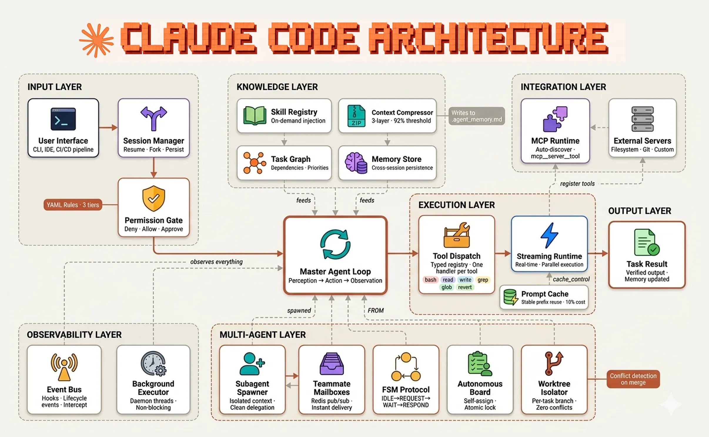

*Claude Code 架構示意圖*

Claude Code 由五個核心元件共同構成：

1. **單執行緒主循環**——驅動模型完成感知、推理與工具執行週期，將結果持續反饋至上下文，直到任務達到終止狀態。
2. **型別化工具調度登錄表**——將工具名稱映射到處理器（bash、read、write、grep、glob），每個工具都有嚴格的輸入 Schema，限制模型的表達方式以及 Harness 必須執行的內容。
3. **上下文管理層**——結合按需技能注入、三層對話壓縮以及磁碟持久化記憶，在超出模型上下文窗口的長對話中維持連貫的推理。
4. **基於規則的權限治理系統**——具有三個評估層級：永遠拒絕、永遠允許、以及需要使用者批准；並由生命週期事件匯流排支撐，允許外部鉤子觀察和攔截每一個工具呼叫。
5. **多智能體協調層**——支援子智能體上下文隔離、非同步隊友委派、FSM 管理的智能體間協議，以及 git worktree 隔離，用於並行任務執行而不產生檔案級衝突。

這些元件之內還有更多……

> 在這篇文章中，我們將逐一構建和測試 Claude Code 的每個元件，並了解它們如何協同工作，超越其他智能體框架。

所有程式碼都可以在 GitHub 儲存庫中找到。

程式碼結構如下：

```
claude-code-from-scratch/
│
├── core.py
├── 01_perception_action_loop.py
├── s02_tool_use.py
├── s03_todo_write.py
├── s04_subagent.py
...
├── s10_team_protocols.py
├── s11_autonomous_agents.py
├── s12_worktree_task_isolation.py
│
├── s13_streaming.py
...
├── s21_mcp_runtime.py
│
├── s22_production_mailbox.py
├── s23_worktree_advanced.py
...
└── skills/
```

我將 Claude Code 架構的每個元件分離到不同的腳本中，這樣我們可以單獨執行和測試每個元件。

---

## 目錄

- 什麼是 Harness 工程？
- Claude Code 如何使用 Harness 工程？
- 第一階段：核心智能體循環
  - 最小化 While 循環
  - 工具調度映射模式
  - TodoWrite 執行前規劃
  - 子智能體上下文隔離
- 第二階段：知識與上下文管理
  - 按需技能載入
  - 三層上下文壓縮
  - 基於檔案的任務依賴圖
- 第三階段：非同步執行與多智能體團隊
  - 帶通知的後台任務執行
  - 具有 JSONL 郵箱的持久隊友
  - FSM 團隊通訊協定
  - 自主任務自我分配
  - Git Worktree 任務隔離
- 第四階段：生產強化
  - 即時 Token 串流
  - 擴展工具庫與檔案快照
  - 基於 YAML 規則的權限治理
  - 事件匯流排與生命週期鉤子
  - 對話持久化、恢復與分支
- 第五階段：高性能非同步執行時
  - 使用 asyncio.gather 並行工具執行
  - 即時中斷注入
  - 提示詞快取與 KV 快取最佳化
  - 官方 MCP 執行時整合
- 第六階段：企業級升級
  - Redis Pub/Sub 生產郵箱
  - 進階 Worktree 生命週期管理
  - 所有機制的組合
- 如何進一步改進

---

## 什麼是 Harness 工程？

Harness 工程是一門構建 AI 模型周圍環境的學科——而非模型本身。模型負責推理和決策，Harness 負責執行、約束和連接。一個設計良好的 Harness 為模型提供恰好所需的工具，不多不少，並精確地管理它被允許如何使用這些工具。

如果將 Harness 工程的概念分解為四個核心原則：

1. 模型是唯一的決策來源——Harness 永遠不會根據模型的輸出做出分支，它只執行模型所請求的操作。
2. 工具是模型與世界之間的唯一介面——每一個動作，從讀取檔案到生成子智能體，都通過型別化、Schema 驗證的工具呼叫進行。
3. 上下文是一種被管理的資源——模型在每一輪看到的內容，是經過精心策劃、壓縮和刻意注入的，而非盲目累積的。
4. 權限是聲明式的，而非過程式的——什麼是允許的、什麼是被阻止的、什麼需要批准，都定義在配置中，而非散落在各種條件邏輯中。

---

## Claude Code 如何使用 Harness 工程？

Claude Code 不是一個智能體框架，它是一個 Harness——一個在生產環境中部署的最精心設計的 Harness 之一。Anthropic 沒有構建邏輯來決定何時讀取檔案或何時執行測試，他們給了 Claude 做這些事情的工具，並信任模型來決定何時需要它們。

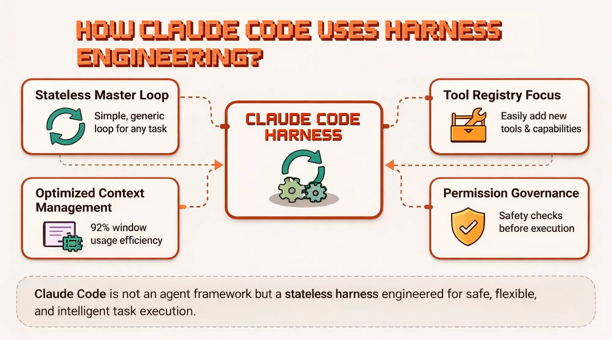

*帶有 Claude 的 Harness 架構*

Claude Code 架構在幾個方面遵循 Harness 工程的原則：

1. 主循環是無狀態且通用的——無論任務是單行修復還是多小時重構，它都以完全相同的方式執行，因為所有任務特定的智能都存在於模型中。
2. 工具登錄表是唯一的擴展點——向 Claude Code 添加新功能意味著只需登錄一個新工具，包含名稱、描述和輸入 Schema。
3. 上下文在約 92% 的窗口使用率時被主動管理——較舊的對話輪次被總結並持久化到磁碟，使模型的工作記憶專注於當前任務。
4. 權限治理作為預執行層運行——每個工具呼叫在 Harness 執行之前都通過規則評估，使安全性成為結構性屬性，而非模型行為。

---

## 第一階段：核心智能體循環

智能體循環是所有其他一切構建的單一架構原語。在工具、權限、多智能體協調之前，有一個循環：呼叫模型、觀察它想做什麼、執行它、然後反饋結果。

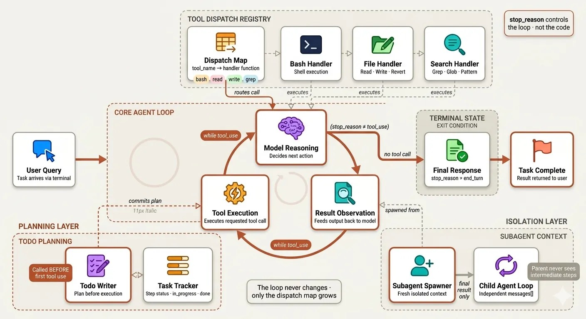

*第一階段——核心智能體循環*

> 這個階段的每個對話都向循環添加一個機制，而不改變循環本身。

### 最小化 While 循環

任何智能體系統最基本的原則是感知-行動-觀察週期：

1. 智能體接收任務，嘗試使用工具解決問題
2. 觀察結果，決定是繼續還是停止——全部由模型驅動，而非程式碼。

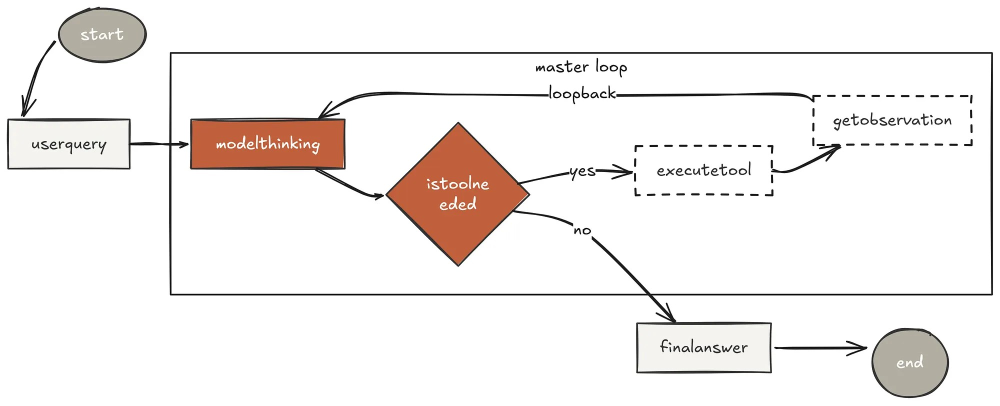

*最小化 While 循環*

這不是一個重試循環或回退機制，它是核心推理引擎。在 Claude Code 中，這是 `nO` 主循環——無論你讓 Claude 修復單行 bug 還是重構整個程式碼庫，都是同一個循環執行。程式碼從不改變，只有模型決定在其中做什麼會改變。

要使用 Anthropic 模型構建 Claude Code 最基本的現象，我們首先需要初始化客戶端和模型：

```python
from anthropic import Anthropic

ANTHROPIC_API_KEY=sk-ant-xxx

MODEL_ID=claude-sonnet-4-6

client  = Anthropic(base_url="https://api.anthropic.com", api_key=ANTHROPIC_API_KEY)
MODEL   = MODEL_ID

DEFAULT_SYSTEM = f"You are a coding agent at {os.getcwd()}. Use tools to solve tasks. Act, don't explain."
```

由於我們在構建 Claude，所以使用 Anthropic 模型，但你可以使用 `litellm` 切換到任何你喜歡的模型，我的 GitHub 程式碼庫靈活地支援任何模型提供商。

> 系統提示詞是智能體行為的基礎——系統提示詞通常不太有用，但設定模型解決任務的方式卻至關重要。

如前所述，Claude 是圍繞工具構建的，因此我們需要為智能體定義一些基本工具以與世界互動：

```python
BASIC_TOOLS = [
    {
        "name": "bash",
        "description": "Run a shell command.",
        "input_schema": {
            "type": "object",
            "properties": {"command": {"type": "string"}},
            "required": ["command"],
        },
    },
]
```

在這裡，我們定義了一個名為 `bash` 的工具，允許模型執行 Shell 命令。工具有名稱、描述和指定輸入預期格式的輸入 Schema。

```python
BASIC_DISPATCH: dict = {
    "bash": lambda inp: run_bash(inp["command"]),
}
```

調度是將模型的工具呼叫連接到實際程式碼執行的機制。它是一個將工具名稱映射到處理器函數的字典。這對於像 Claude Code 這樣包含大量工具的大型架構非常重要——它讓我們將工具定義與其實作分離，並且可以輕鬆添加新工具而無需更改核心循環。

```python
def dispatch_tools(response_content: list, dispatch: dict) -> List[Dict[str, Any]]:
    """
    執行模型回應中的所有 tool_use 塊，並收集結果。

    Args:
        response_content (list): Anthropic Message 物件的 `content` 列表。
        dispatch (dict): 用於路由工具呼叫的調度映射。
    Returns:
        list: 準備傳回模型的 `tool_result` 字典列表。
    """

    results = []

    for block in response_content:
        if block.type != "tool_use":
            continue
        tool_name = block.name
        tool_input = block.input
        tool_use_id = block.id
        handler = dispatch.get(tool_name)

        first_val = str(list(tool_input.values())[0])[:80] if tool_input else ""
        print(f"\033[33m[{tool_name}] {first_val}...\033[0m")
        if handler:
            try:
                output = handler(tool_input)
            except Exception as e:
                output = f"Error during tool execution: {e}"
        else:
            output = f"Error: Unknown tool '{tool_name}'"

        print(str(output)[:300])

        results.append({
            "type": "tool_result",
            "tool_use_id": tool_use_id,
            "content": str(output),
        })

    return results
```

`dispatch_tools` 是一個輔助函數，它接收模型的回應內容，識別任何工具呼叫，使用提供的調度映射執行它們，並收集結果。它還包含日誌記錄，以提高對呼叫了哪些工具及其輸出的可見性。

```python
def agent_loop(messages: List[Dict[str, Any]], dispatch: Dict) -> None:
    """
    執行核心智能體互動循環，直到模型提供最終答案。

    此函數就地修改 `messages` 列表，添加每個新的
    助手回應和任何工具呼叫的結果。
    Args:
        messages (list): 對話歷史，將被更新。
        dispatch (dict): 工具名稱到其處理器函數的映射。
    """

    while True:

        print("\n\033[36m> Thinking...\033[0m")
        response = client.messages.create(
            model=MODEL,
            system=DEFAULT_SYSTEM,
            messages=messages,
            tools=BASIC_TOOLS,
            max_tokens=8000,
        )

        messages.append({"role": "assistant", "content": response.content})

        if response.stop_reason != "tool_use":
            break

        results = dispatch_tools(response.content, dispatch)

        messages.append({"role": "user", "content": results})
```

我們的智能體循環是一個簡單的 while 循環，持續執行直到模型表示已達到最終答案。

讓我們用一個簡單任務執行這個元件，看看它如何工作：

```
s01 >> List all Python files in the current directory.
> Thinking...

[Tool Call: bash]
Command: ls *.py
[Result]
bash: ls: command not found

> Thinking...
[Tool Call: bash]

Command: find . -name "*.py" -type f

[Result]
./main.py
./utils.py
./agent.py

Final Answer:
- main.py
- utils.py
- agent.py
```

我在一個有一些 Python 檔案的目錄中執行了它。第一次嘗試時，智能體使用了一個不正確的命令並得到了錯誤。然後它自我糾正，使用了適當的 `find` 命令，成功取得了 Python 檔案列表，展示了帶有真實世界錯誤恢復的感知-行動-觀察週期。

---

### 工具調度映射模式

**在 Claude Code 的內部架構中，工具登錄表是逆向工程執行追蹤的工程師研究最多的元件之一。**

1. Claude Code 附帶 18 個已登錄工具，如 bash、read、write、edit、glob、grep、WebFetch、AskUserQuestion、TodoWrite 等。
2. 使這個系統優雅的不是工具的數量，而是添加新工具不需要對核心循環做任何更改。

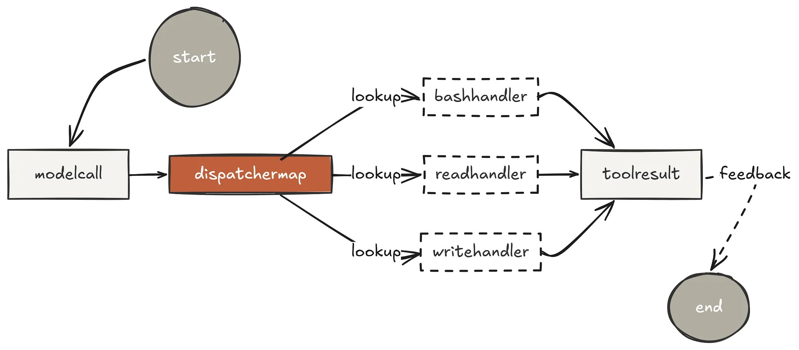

*工具調度模式*

> 調度映射是使這成為可能的架構模式。

調度映射是一個連接模型想做什麼與執行此操作的程式碼的字典。循環對工具的存在完全不可知——它只知道如何呼叫 `dispatch[tool_name]`。

這種分離意味著 Claude Code 可以擁有 18 個工具、30 個工具或 5 個工具，循環本身永遠不會改變。這與使 Claude Code 可以通過 MCP 擴展的原則相同——新工具只是登錄表中的新條目，無論它們是本地 Python 函數還是遠端伺服器。

```python
EXTENDED_DISPATCH: dict = {
    "bash":   lambda inp: run_bash(inp["command"]),
    "read":   lambda inp: run_read(inp["path"], inp.get("start_line"), inp.get("end_line")),
    "write":  lambda inp: run_write(inp["path"], inp["content"]),
    "grep":   lambda inp: run_grep(inp["pattern"], inp.get("path", ".")),
    "glob":   lambda inp: run_glob(inp["pattern"]),
    "revert": lambda inp: run_revert(inp["path"]),
}
```

每個鍵都是模型在工具呼叫中使用的確切名稱。每個值都是執行它的 Python 函數。當 Claude 決定讀取檔案時，循環執行一次字典查找並呼叫處理器。沒有條件語句，沒有類別層次結構，沒有框架路由邏輯。整個調度機制只有一行：`output = handler(tool_input)`。

工具定義同樣重要。這些是模型讀取以決定呼叫哪個工具的內容——描述欄位不是文件說明，它是一個指令。

```python
EXTENDED_TOOLS = BASIC_TOOLS + [
    {
        "name": "read",
        "description": "讀取檔案並返回帶編號的行。當需要檢查檔案內容或引用特定行號時使用。返回最多 50,000 個字元。對大型檔案使用 start_line/end_line。",
        "input_schema": {
            "type": "object",
            "properties": {
                "path":       {"type": "string"},
                "start_line": {"type": "integer"},
                "end_line":   {"type": "integer"},
            },
            "required": ["path"],
        },
    },
    # ... 更多工具
]
```

描述寫得不好會導致模型選擇錯誤的工具。**Claude Code 的內部工具描述對於何時應使用每個工具非常具體——這種具體性是在數百萬次執行中產生一致、可預測的工具選擇的原因。**

處理器函數本身遵循一致的契約——它們接受一個輸入字典，返回一個字串，並且永遠不會向循環拋出異常。錯誤以字串形式返回，而不是拋出。

```
s02 >> Find all TODO comments in the codebase and show me which files they are in.

> Thinking...
[grep] TODO
./agents/s03_todo_write.py:45:
./agents/s09_agent_teams.py:112:

> Thinking...
Final Answer:
Found 2 TODO comments across 2 files:
- s03_todo_write.py line 45: add priority levels to tasks
- s09_agent_teams.py line 112: replace JSONL mailboxes with Redis
```

模型選擇了 `grep` 而不是 `bash`，因為工具描述足夠精確，讓正確的選擇顯而易見。這就是調度映射按預期工作的方式。工具選擇的智能完全存在於模型中——Harness 只需對工具描述得足夠好，讓模型能夠將意圖與能力匹配。

---

### TodoWrite 執行前規劃

逆向工程 Claude Code 執行追蹤最具啟示性的發現之一，是 Claude 在複雜任務中在寫入單行程式碼或讀取單個檔案之前所做的事情。它呼叫 `TodoWrite`，每次都是。

> 計劃先於行動，只有在計劃確定後才採取行動。

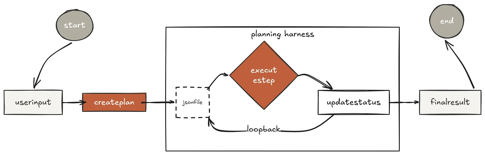

*TodoWrite*

1. 這不是偶然的。Anthropic 觀察到，沒有明確的規劃機制，模型在多步驟任務中會偏離。
2. 它開始執行，遇到一個看起來有趣的中間結果，跟著它走，二十分鐘後出現時做了一些相鄰但並非確切被要求的事情。
3. TodoWrite 工具在架構層面解決了這個問題——不是讓模型更聰明，而是給它一個在整個執行過程中對自己負責的承諾機制。

Claude Code 在每次工具呼叫後將當前 todo 狀態作為系統提醒注入。模型無法忘記它計劃做什麼，因為計劃被持續重新注入其上下文。這就是允許 Claude Code 可靠地完成跨越數十個工具呼叫的任務而不失去目標的原因。

```python
TODO_FILE = Path(".agent_todo.json")

def todo_write(tasks: list) -> str:
    data = [{"id": i, "task": t, "status": "pending"} for i, t in enumerate(tasks)]
    TODO_FILE.write_text(json.dumps(data, indent=2))
    return "Plan written:\n" + "\n".join(f"  [{i}] {t}" for i, t in enumerate(tasks))

def todo_read() -> str:
    if not TODO_FILE.exists():
        return "(no plan)"
    data = json.loads(TODO_FILE.read_text())
    return "\n".join(
        f"  [{t['id']}] [{t['status']:12s}] {t['task']}" for t in data
    )

def todo_update(index: int, status: str) -> str:
    data = json.loads(TODO_FILE.read_text())
    data[index]["status"] = status
    TODO_FILE.write_text(json.dumps(data, indent=2))
    return f"Task {index} marked {status}"
```

三個工具作為一個單元協同工作。`todo_write` 在開始時確定完整計劃。`todo_update` 在智能體執行過程中標記每個步驟。`todo_read` 讓模型在任何時間點檢查自己的進度。

系統提示詞被更新以強制規劃：

```python
SYSTEM = (
    f"You are a coding agent at {os.getcwd()}. "
    "Before working on any multi-step task, ALWAYS call todo_write first "
    "to write your complete plan. Execute each step in order. "
    "Call todo_update after completing each step."
)
```

這裡的 `ALWAYS` 承載著重要意義。沒有它，模型有時會規劃。有了它，模型一致地規劃。使用強命令式語言的系統提示詞指令比建議或推薦的指令產生更可靠的行為。

```
s03 >> Refactor the run_bash function to add configurable timeout and output truncation,
       then verify nothing breaks.

> Thinking...
[todo_write]
Plan written:
  [0] Read the current run_bash implementation in core.py
  [1] Add configurable timeout parameter with 120s default
  [2] Add output truncation at 50,000 characters
  [3] Write the updated implementation back to core.py
  [4] Run the test suite to verify no regressions

[read] core.py (lines 45-72)
[todo_update] 0 → done

> Thinking...
[write] core.py
[todo_update] 1 → done
[todo_update] 2 → done
[todo_update] 3 → done

> Thinking...
[bash] python -m pytest tests/test_agents_smoke.py -q
44 passed in 2.1s

[todo_update] 4 → done

Final Answer:
Refactor complete. Added 120s configurable timeout and 50,000 character output
truncation to run_bash. All 44 smoke tests passing. No regressions.
```

模型在觸碰任何檔案之前確定了五個步驟。它按順序執行。它驗證了自己的工作。這不是模型天生謹慎，而是 Harness 給模型提供了一個結構，使謹慎執行成為阻力最小的路徑。

---

### 子智能體上下文隔離

Claude Code 的執行追蹤揭示了一個有趣的事情：它如何處理大型程式碼庫探索。

1. 當被要求理解一個新的儲存庫時，Claude 不會直接將檔案讀入主對話。
2. 它生成三個並行探索子智能體，每個都有不同的焦點，每個都在與主上下文完全隔離的環境中執行。主對話接收三個清晰的摘要。
3. 它從不會看到產生這些摘要的數十個中間檔案讀取、grep 輸出和目錄列表。

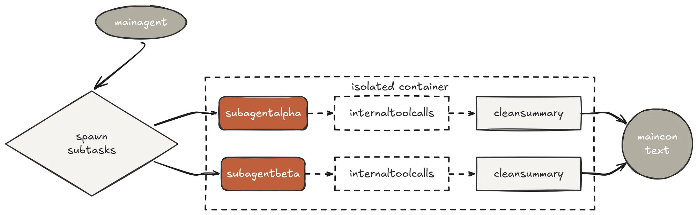

*子智能體上下文*

這就是子智能體上下文隔離——允許 Claude Code 在任意大的程式碼庫上工作，而主對話窗口不會充滿噪音的模式。每個與最終答案無關的中間結果都停留在子智能體內部，並在其完成時被丟棄。父智能體只為它實際需要的上下文付費。

隔離通過給每個子智能體一個完全獨立的 `messages[]` 列表來實現。父子之間除了子智能體返回的最終文字回應外，沒有共享狀態。

```python
SUBAGENT_SYSTEM = (
    f"You are a subagent working on a specific subtask at {os.getcwd()}. "
    "Complete your task thoroughly and summarise your findings clearly. "
    "Your output will be the only thing the parent agent sees."
)

def spawn_subagent(prompt: str) -> str:
    """Run a fresh agent loop with completely isolated context."""
    print(f"\033[35m  [subagent spawned] {prompt[:60]}\033[0m")

    sub_messages = [{"role": "user", "content": prompt}]
    while True:
        resp = client.messages.create(
            model=MODEL,
            system=SUBAGENT_SYSTEM,
            messages=sub_messages,
            tools=EXTENDED_TOOLS,
            max_tokens=8000,
        )
        sub_messages.append({"role": "assistant", "content": resp.content})

        if resp.stop_reason != "tool_use":
            break

        results = dispatch_tools(resp.content, EXTENDED_DISPATCH)
        sub_messages.append({"role": "user", "content": results})

    result = "".join(
        b.text for b in sub_messages[-1]["content"] if hasattr(b, "text")
    )

    print(f"\033[35m  [subagent done] {result[:80]}\033[0m")

    return result
```

子智能體執行與父智能體完全相同的智能體循環，可以訪問完全相同的工具。唯一的區別是它的 `messages[]` 列表從空開始，它的系統提示詞將其聚焦在一個有限的任務上。當它完成時，它積累的所有內容——每次檔案讀取、每次 grep 輸出、每個中間推理步驟——都被丟棄。只有最終摘要跨越回父智能體。

```
s04 >> Analyse the entire codebase and give me a complete summary of the architecture.

> Thinking...
[spawn_subagent] Explore all Python files in the agents/ directory...
  [subagent] > Thinking...
  [subagent] [glob] agents/**/*.py → 25 files found
  [subagent] [read] agents/core.py
  ... (22 more reads, all inside the subagent)
  [subagent done] core.py exports client, tools, and dispatch maps...
> Thinking...

Final Answer:
The codebase has a single shared foundation (core.py) that is imported by
23 session files. Each session adds exactly one mechanism without duplicating
any tool code.
```

父對話包含一個工具呼叫，子智能體執行了二十五個。父的上下文恰好增長了一個摘要段落。

> 隔離使主智能體的推理保持在正確的抽象級別。

---

## 第二階段：知識與上下文管理

第三階段關於認知基礎設施——智能體超越單一對話執行，僅在需要時載入領域知識。

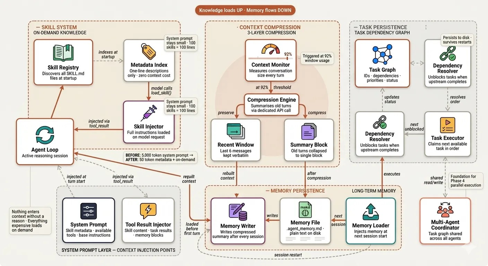

*知識與上下文管理*

在推理品質下降之前壓縮對話歷史，並將任務狀態持久化到磁碟，以便工作在進程重啟後依然存在。這裡是 Claude Code 技能系統、壓縮器 `wU2` 和長期記憶檔案的來源。

### 按需技能載入

Harness 工程中最昂貴的錯誤之一是將模型可能需要的所有內容放入系統提示詞中。

1. 一個包含 PDF 處理指南、程式碼審查方法、部署清單和安全審計框架的系統提示詞，在每次 API 呼叫時都會消耗數千個 Token——絕大多數與模型當前正在做的事情無關。
2. **Claude Code 用漸進式披露解決了這個問題**——這與使其技能系統成為架構上最清晰的元件之一的模式相同。

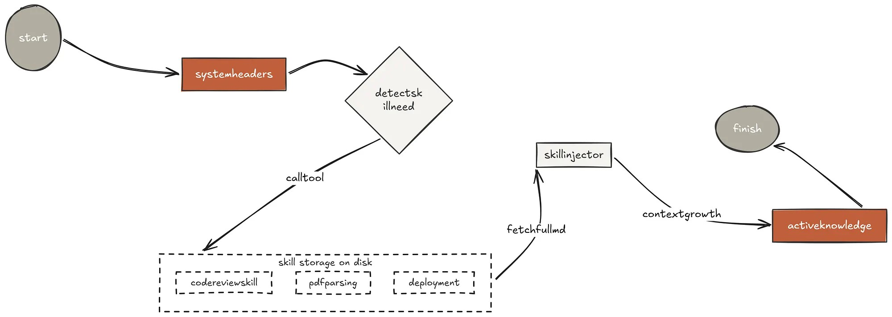

*按需技能*

模型系統提示詞只包含可用技能的單行描述。當模型認識到它需要當前任務的領域專業知識時，它呼叫 `load_skill()`，完整指令通過工具結果直接注入對話，恰好在需要的時刻。模型只在知識真正相關時才付出上下文成本。安裝一百個技能，系統提示詞增長一百行，而不是一百頁。

技能目錄結構：

```
skills/
├── agent-builder/
│   └── SKILL.md
├── code-review/
│   └── SKILL.md
└── pdf/
    └── SKILL.md
```

技能檔案的發現機制在啟動時掃描技能目錄，只從每個 SKILL.md 讀取元資料標頭，並建立一個進入系統提示詞的輕量級登錄表。

```
s05 >> Review agents/core.py for bugs, security issues, and code quality problems.

> Thinking...
[load_skill] code-review

=== SKILL: code-review ===
1. Read the full file before commenting...

> Thinking...
[read] agents/core.py

> Thinking...
Final Answer:

[SECURITY] core.py:62
  Issue: shell=True with unsanitised input enables command injection.
  Fix: Validate against the _ALWAYS_BLOCK list before execution.

[PERF] core.py:78
  Issue: run_grep spawns a new subprocess for every call with no caching.
  Fix: Add an LRU cache keyed on (pattern, path) for repeated queries.

Summary: 1 security issue (blocking), 1 performance issue, 1 style issue.
Not safe to deploy without addressing the security finding.
```

模型載入了技能，應用了其結構化的方法，並產生了帶有檔案和行引用的發現。技能不使模型更聰明，它使模型的輸出在每次程式碼審查中都是一致且結構化的。

---

### 三層上下文壓縮

每個長時間執行的對話都會遇到同樣的牆。上下文窗口充滿了工具輸出、中間結果和十分鐘前相關但現在只是噪音的對話輪次。

> Claude Code 的壓縮器 `wU2` 在約 92% 的上下文窗口使用率時自動觸發。

它不丟棄歷史，而是對其進行總結，保留資訊同時大幅減少 Token 佔用。摘要隨後被寫入磁碟上的持久化 Markdown 檔案，使智能體的記憶在對話重啟後依然耐用。

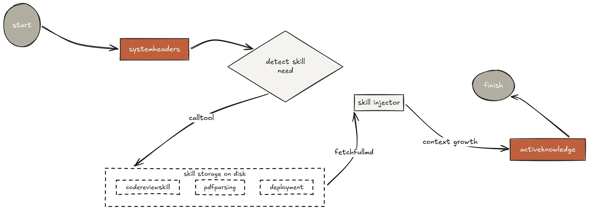

*上下文壓縮*

實現使用三個明確的層按順序處理歷史。最近的消息被逐字保留，因為它們包含活動推理上下文。較舊的消息通過專用壓縮 API 呼叫折疊成一個摘要塊。該摘要被寫入 `.agent_memory.md`，以便下一個對話可以載入它並繼續而無需從頭開始。

```python
COMPRESS_THRESHOLD = 40_000
KEEP_RECENT        = 6
MEMORY_FILE        = Path(".agent_memory.md")
```

壓縮在每次智能體回應輪次後被呼叫——不是按計時器，而是根據測量的上下文大小。

---

### 基於檔案的任務依賴圖

上下文壓縮使對話窗口保持可管理狀態。但它解決的問題與任務追蹤不同。壓縮關於模型記住什麼，任務圖關於智能體跨對話、跨重啟、最終跨並行工作的多個智能體所承諾做什麼。

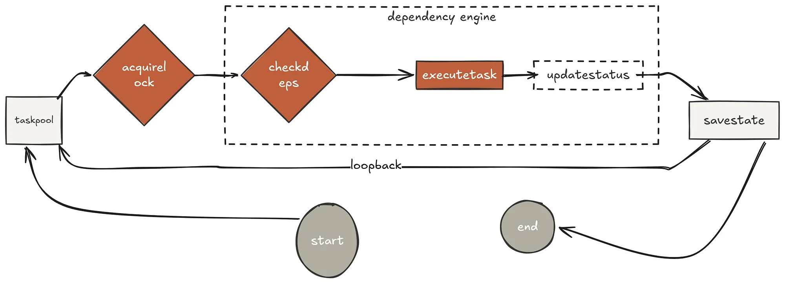

*基於檔案的任務圖*

Claude Code 的 TodoWrite 系統是對話範圍的。關閉終端，計劃就消失了。這個對話中的任務圖將其擴展為持久的、依賴感知的結構。每個任務帶有 ID、描述、狀態、優先級和必須在其變為可用之前完成的上游任務 ID 的明確列表。

> 圖存在於 `.agent_tasks.json` 中，能夠在進程崩潰、對話重啟和機器重啟中存活。

```python
TASKS_FILE = Path(".agent_tasks.json")
_TASKS_LOCK = threading.Lock()

def run_task_create(description: str, depends_on: list = None,
                    priority: str = "medium") -> str:
    with _TASKS_LOCK:
        tasks = _load()
        task = {
            "id":          uuid.uuid4().hex[:8],
            "description": description,
            "status":      "pending",
            "priority":    priority,
            "depends_on":  depends_on or [],
            "result":      "",
        }
        tasks.append(task)
        _save(tasks)
    return f"created task {task['id']}: {description}"

def run_task_next() -> str:
    """返回下一個未阻塞的待處理任務——遵守依賴鏈。"""
    tasks = _load()
    done_ids = {t["id"] for t in tasks if t["status"] == "done"}
    for t in sorted(tasks, key=lambda x: {"high":0,"medium":1,"low":2}[x["priority"]]):
        if t["status"] != "pending":
            continue
        if all(dep in done_ids for dep in t.get("depends_on", [])):
            return f"[{t['id']}] [{t['priority']}] {t['description']}"
    return "(no unblocked tasks available)"
```

每次讀寫操作上的執行緒鎖至關重要。在第四階段，多個智能體將同時呼叫 `_load()` 和 `_save()`。沒有鎖，兩個智能體可以同時讀取相同狀態，各自獨立修改，第二次寫入會靜默地覆蓋第一個智能體的更改。鎖使每個任務狀態轉換都是原子操作。

---

## 第三階段：非同步執行與多智能體團隊

第四階段關於打破單智能體上限——一個上下文窗口和一個執行線程已不再足夠。在後台線程中執行慢速操作而不阻塞主循環，將並行工作流委派給持久專業智能體，用有限狀態機管理智能體間通訊，在沒有中央協調器的情況下實現自主任務認領，以及在 git worktree 級別隔離並行檔案寫入。

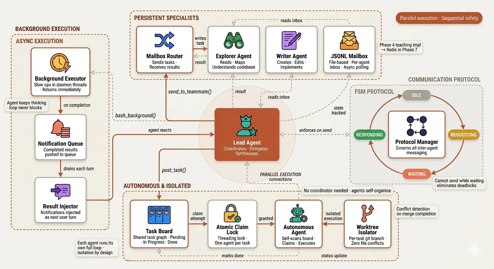

*多智能體團隊*

> 這是 Claude Code 的並行子智能體生成、後台執行隊列和任務委派架構從第一原則重建的地方。

### 帶通知的後台任務執行

**在 Claude Code 的內部架構中，`h2A` 非同步隊列是其最實用的性能機制之一。** 當 Claude 執行測試套件、編譯項目或執行長時間資料庫遷移時，它不會閒置等待結果。

它將操作推送到後台，繼續規劃下一步，並在操作完成時收到通知。主推理循環從不阻塞在 I/O 上。

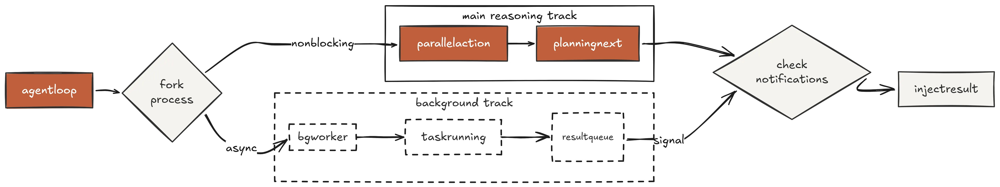

*任務執行*

沒有這種機制，編碼智能體的速度只有其最慢工具呼叫的速度。一個需要 45 秒的測試套件意味著 45 秒的沉默——沒有規劃，沒有並行工作，沒有進展。後台執行通過將操作執行與智能體的推理週期解耦，完全消除了這個上限。

```python
import threading
import queue
import subprocess

_BG_QUEUE: queue.Queue = queue.Queue()

def run_bash_background(command: str, label: str = "") -> str:
    """在後台守護線程中啟動 Shell 命令，立即返回。"""
    label = label or command[:40]

    def _run():
        print(f"\033[90m  [bg] started: {label}\033[0m")
        try:
            r = subprocess.run(
                command, shell=True, capture_output=True,
                text=True, timeout=300, cwd=os.getcwd()
            )
            output = (r.stdout + r.stderr).strip()[:2000] or "(no output)"
            status = "completed"
        except subprocess.TimeoutExpired:
            output = "Error: operation timed out after 300s"
            status = "timed out"
        except Exception as e:
            output = f"Error: {e}"
            status = "failed"

        _BG_QUEUE.put(
            f"[Background task '{label}' {status}]\n{output}"
        )

    thread = threading.Thread(target=_run, daemon=True)
    thread.start()
    return f"Background task started: '{label}'. You will be notified when it completes."
```

**有了後台執行，牆時間由兩個操作中較慢的一個限制，而不是它們的總和。** 這正是 Claude Code 在實踐中處理長時間操作的方式。

---

### 具有 JSONL 郵箱的持久隊友

Claude Code 並行子智能體系統生成短暫智能體——它們為一個任務而創建並在完成後被丟棄。但真實的工程工作有跨許多任務持續的專業化。一個檔案探索專家、一個程式碼寫作專家和一個測試專家，每個都受益於關於它們正在工作的程式碼庫的累積上下文。持久隊友在多個委派任務中保留那些上下文。

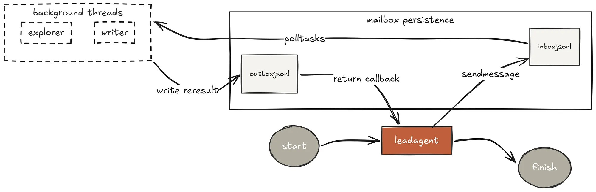

*持久隊友*

每個隊友在後台線程中持續運行，具有定義的專業化和 JSONL 檔案作為其收件箱。主智能體將任務寫入隊友的收件箱檔案。隊友讀取它，執行完整的智能體循環，並將結果寫回主智能體的收件箱。

通訊是完全非同步的——主智能體可以在隊友執行時繼續工作，而隊友關於程式碼庫的累積知識隨著每個處理的任務而增長。

```python
MAILBOX_DIR = Path(".mailboxes")
MAILBOX_DIR.mkdir(exist_ok=True)

TEAMMATES = {
    "explorer": (
        f"You are an explorer agent specialising in reading and understanding "
        f"codebases at {os.getcwd()}. You excel at mapping architecture, finding "
        f"patterns, and understanding how components connect. Use read, glob, grep."
    ),
    "writer": (
        f"You are a writer agent specialising in creating and editing code at "
        f"{os.getcwd()}. You excel at implementing changes cleanly, following "
        f"existing patterns, and writing tests. Use write, read, bash."
    ),
}
```

> 隊友可以隨著時間處理多個任務，通過每次互動積累關於程式碼庫的知識。

---

### FSM 團隊通訊協定

在多個智能體同時發送和接收消息的情況下，未協調的通訊會產生競態條件和死鎖。智能體可能在收到第一個請求的回應之前發送第二個請求。兩個智能體可能無限期地等待對方。

**沒有管理智能體何時可以通訊的協定，團隊在負載最重的時刻是不可靠的。**

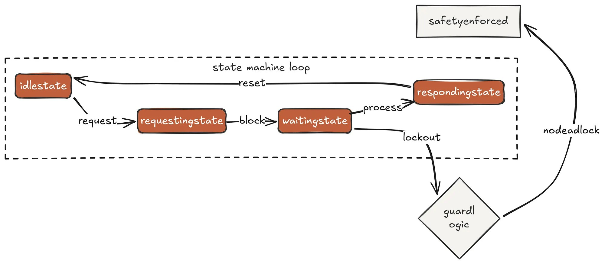

*有限狀態機*

Claude Code 通過工具呼叫的同步性質隱式地解決了智能體間協調——模型發出 `dispatch_agent` 呼叫並等待結果後再繼續。FSM 使這個協定對持久隊友架構（通訊是非同步的）變得明確和強制。每個智能體有四個狀態：IDLE（空閒）、REQUESTING（請求中）、WAITING（等待中）、RESPONDING（回應中），以及一個嚴格規則：沒有智能體在 WAITING 時轉換到 REQUESTING。這個單一規則消除了整個協調死鎖類別。

```python
from enum import Enum

class AgentState(Enum):
    IDLE       = "idle"
    REQUESTING = "requesting"
    WAITING    = "waiting"
    RESPONDING = "responding"

class ProtocolAgent:

    def __init__(self, name: str, system: str):
        self.name   = name
        self.system = system
        self.state  = AgentState.IDLE
        self._inbox = MAILBOX_DIR / f"{name}_proto.jsonl"
        self._lock  = threading.Lock()

    def send(self, to: "ProtocolAgent", message: str):
        with self._lock:
            if self.state == AgentState.WAITING:
                return f"Error: cannot send while waiting for a response"
            self.state = AgentState.REQUESTING
        # ... 發送邏輯
        with self._lock:
            self.state = AgentState.WAITING
        return f"Message sent to {to.name}. Waiting for response."
```

當我執行這個測試時，每個狀態轉換都被記錄。沒有智能體在收到第一個請求的回應之前發送第二個請求。協定在架構層面強制執行了這一點，而不需要模型推理協調。

---

### 自主任務自我分配

FSM 協定管理智能體間的通訊，但仍然需要一個主智能體來分配工作。對於非常大的工作負載——遷移整個程式碼庫、為數百個函數生成文件、在數千個檔案上執行分析——即使是主智能體也會成為瓶頸。自主自我分配完全移除了協調器。

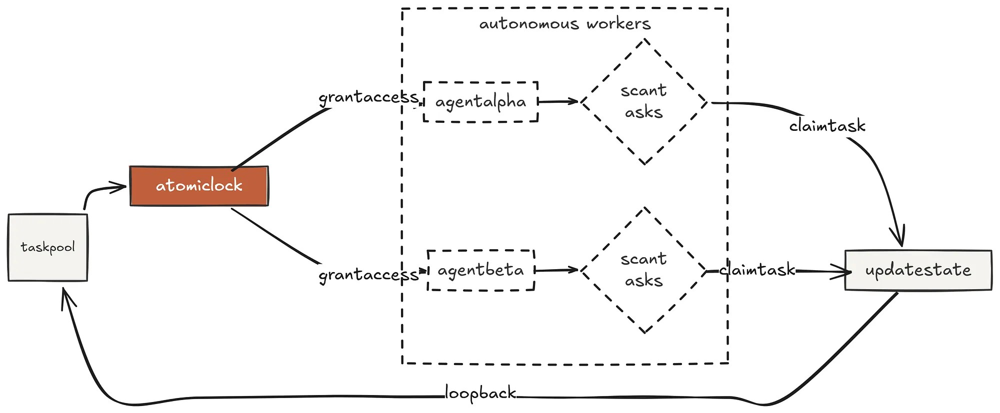

*自我分配*

每個智能體對第三階段的共享任務圖執行連續掃描循環。當它找到一個未阻塞的待處理任務時，它使用執行緒鎖原子地認領它並開始執行。

```python
def claim_next_task(agent_id: str) -> dict | None:
    """原子地找到並認領下一個可用的未阻塞任務。"""

    with _TASKS_LOCK:
        tasks = _load()
        done_ids = {t["id"] for t in tasks if t["status"] == "done"}

        priority_order = {"high": 0, "medium": 1, "low": 2}
        sorted_tasks = sorted(tasks, key=lambda t: priority_order.get(t["priority"], 1))

        for t in sorted_tasks:
            if t["status"] != "pending":
                continue

            if all(dep in done_ids for dep in t.get("depends_on", [])):
                t["status"]     = "in_progress"
                t["claimed_by"] = agent_id
                _save(tasks)
                return t
    return None
```

兩個智能體在任務可用的那一刻認領它們，並行工作，mypy 驗證任務在所有六個標注任務被標記為完成之前保持阻塞。**在初始發佈後，主智能體沒有分配任何單個任務。** 這是使大規模自主工作可行的模式——任務排序的智能存在於依賴圖中，而不在協調器智能體中。

---

### Git Worktree 任務隔離

並行智能體寫入同一目錄中的相同檔案最終會衝突。兩個智能體同時編輯 `core.py` 將產生一個損壞的檔案，無論每個智能體工作得多小心。

> 檔案系統不知道智能體的意圖——它只知道寫操作，兩個並發寫入產生未定義的結果。

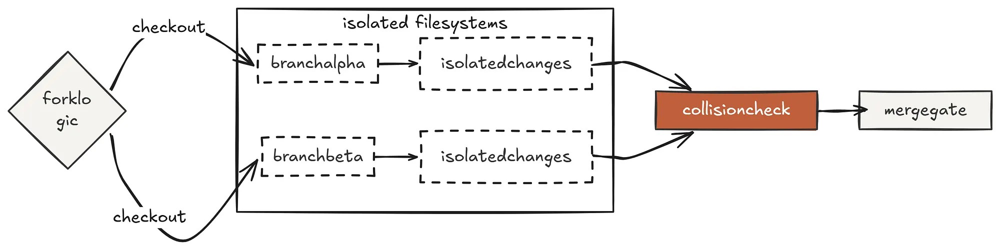

*Worktree*

Git worktrees 給每個智能體其自己的完整儲存庫簽出——其自己的目錄、其自己的分支、其自己的工作樹。並行工作的兩個智能體實際上是在不同目錄中的不同檔案上工作。不可能有寫衝突，因為檔案本身是分開的。當兩個任務完成時，Harness 比較每個分支修改了哪些檔案，並在合併之前為人工審查顯示任何重疊的更改。

```
s12 >> Run two tasks in parallel:
       Task A: Add input validation to all tool functions in core.py
       Task B: Add logging statements to all tool functions in core.py

> Thinking...
  Running 2 tasks in parallel worktrees...
   [task-a] worktree created: .worktree-a1b2c3d4 (branch: task/a1b2c3d4)
  [task-b] worktree created: .worktree-e5f6a7b8 (branch: task/e5f6a7b8)
  ...
  Conflict detection:
  Both branches modified: agents/core.py
  Overlap detected on 1 file - human review required before merging.
```

兩個智能體同時讀取和修改了 `core.py`，但因為它們在不同的 worktree 中工作，所以沒有寫入相互干擾。每個智能體對自己的分支執行了測試套件並獲得了清潔的結果。衝突檢測在兩個完成後執行，並正確識別出人工需要在任何分支落地主幹之前審查合併。這是儲存庫中最強的隔離模型——並行執行，零中任務干擾的可能性。

---

## 第四階段：生產強化

第五階段關於工作智能體和可部署智能體之間的差距——串流使模型的輸出即時可見，檔案工具通過自動快照變得可逆，權限治理通過 YAML 規則系統變得聲明式，每個工具呼叫通過生命週期事件匯流排變得可觀察，對話通過對話持久化變得耐用。

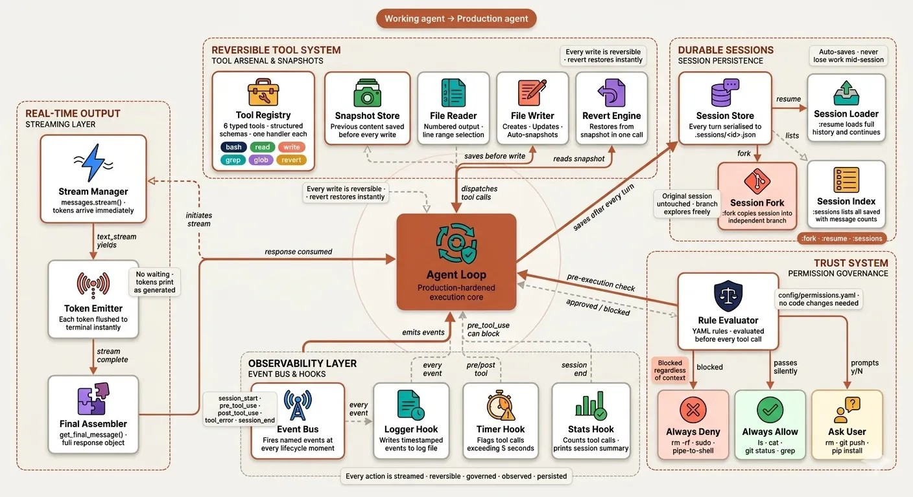

*生產強化*

> 這是 Claude Code 的信任系統、鉤子架構和對話持久化的實現位置。

### 即時 Token 串流

在 Claude Code 中，串流不是一個功能，而是默認行為。每次互動都將 Token 串流到終端，隨著它們的生成。串流智能體和阻塞智能體之間的區別，是感覺像協作者的工具和感覺像批處理作業的工具之間的區別。

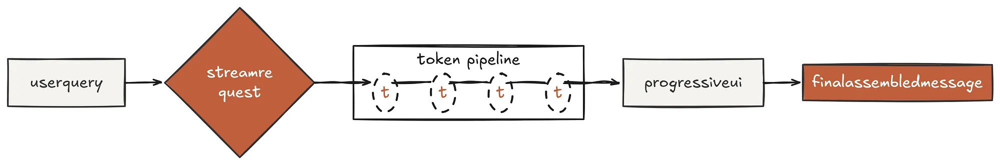

*即時 Token 串流*

從阻塞到串流的改變是一個單一的交換——`client.messages.create()` 變成 `client.messages.stream()`。循環邏輯保持完全相同。**這意味著所有下游邏輯——停止原因檢查、工具使用解析、內容塊提取——無論循環使用串流還是阻塞，都完全相同地工作。**

```python
def agent_loop_streaming(messages: list):
    while True:
        with client.messages.stream(
            model=MODEL,
            system=DEFAULT_SYSTEM,
            messages=messages,
            tools=EXTENDED_TOOLS,
            max_tokens=8000,
        ) as stream:
            for text in stream.text_stream:
                print(text, end="", flush=True)
            response = stream.get_final_message()
        print()

        messages.append({"role": "assistant", "content": response.content})
        if response.stop_reason != "tool_use":
            return

        results = dispatch_tools(response.content, EXTENDED_DISPATCH)
        messages.append({"role": "user", "content": results})
```

---

### 擴展工具庫與檔案快照

Claude Code 提供專用檔案工具 Read、Write、Edit、Glob、Grep——不是因為 bash 不能做檔案操作，而是因為專用工具給模型提供了具有結構化輸出的精確語義操作。

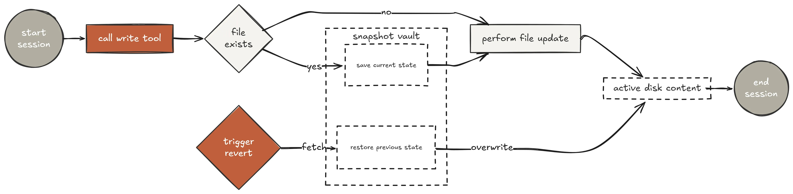

*擴展工具*

快照機制同樣重要。Claude Code 中的每個 `write` 呼叫在覆蓋之前靜默地保存先前的檔案內容。如果模型的更改破壞了某些東西，`revert` 在一次呼叫中恢復原始內容。不需要使用 git，不需要手動複製檔案——Harness 自動處理可逆性。

```python
SNAPSHOTS: dict[str, str | None] = {}

def run_write(path: str, content: str) -> str:
    try:
        if os.path.exists(path):
            with open(path, "r", encoding="utf-8", errors="replace") as f:
                SNAPSHOTS[path] = f.read()
            action = "updated"
        else:
            SNAPSHOTS[path] = None
            action = "created"
        os.makedirs(os.path.dirname(os.path.abspath(path)), exist_ok=True)
        with open(path, "w", encoding="utf-8") as f:
            f.write(content)
        return f"{action}: {path} (snapshot saved - use revert to undo)"
    except Exception as e:
        return f"Error writing {path}: {e}"

def run_revert(path: str) -> str:
    if path not in SNAPSHOTS:
        return f"Error: no snapshot for {path}"
    original = SNAPSHOTS.pop(path)
    if original is None:
        os.remove(path)
        return f"reverted: deleted {path} (it was a new file)"
    with open(path, "w", encoding="utf-8") as f:
        f.write(original)
    return f"reverted: {path} restored to previous content"
```

---

### 基於 YAML 規則的權限治理

Claude Code 的權限系統是其研究最多的架構元件之一。**這個部分將相同的三層模型實現為 YAML 配置檔案。安全策略存在於配置中，而不在程式碼中。** 更改什麼需要批准是對配置檔案的編輯，而不是部署。規則評估作為每個工具呼叫的預執行封裝器運行。

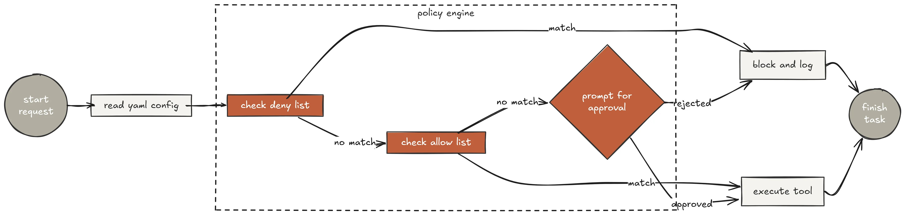

*基於規則的權限*

```yaml
always_deny:
  - pattern: "rm -rf /"
    reason: "無條件遞歸根目錄刪除"
  - pattern: "sudo"
    reason: "不允許特權升級"
  - pattern: "curl.*\\| *sh|wget.*\\| *sh"
    reason: "管道到 Shell 下載被阻止"

always_allow:
  - pattern: "^ls( |$|-)"
    reason: "列出檔案總是安全的"
  - pattern: "^git (status|log|diff|show)"
    reason: "只讀 git 命令總是安全的"

ask_user:
  - pattern: "^rm "
    reason: "檔案刪除需要確認"
  - pattern: "^git (commit|push|merge|rebase)"
    reason: "Git 寫操作需要確認"
  - pattern: "^pip install|^npm install"
    reason: "套件安裝需要確認"
```

```
s15 >> Install the requests library, then delete the old requirements.txt
       and create a new one with all current dependencies.

[bash] pip install requests
  [PERMISSION] bash: pip install requests
  Reason: Package installation requires confirmation
  Allow? [y/N] y

[bash] rm requirements.txt
  [PERMISSION] bash: rm requirements.txt
  Reason: File deletion requires confirmation
  Allow? [y/N] y

Final Answer:
Installed requests. Deleted old requirements.txt (confirmed by you).
Created new requirements.txt with 7 current dependencies.
```

出現了兩個權限提示——一個用於套件安裝，一個用於檔案刪除。兩者都需要明確批准才能執行。`ls`、`read` 和 `pip freeze` 呼叫靜默運行，因為它們匹配 `always_allow` 模式。這正是 Claude Code 的權限系統在確認模式下的行為方式——模型在安全操作上不間斷地工作，只有在動作有真實後果時才暫停。

---

### 事件匯流排與生命週期鉤子

Claude Code 暴露了一個鉤子系統，允許使用者將自定義邏輯附加到智能體生命週期的任何點——在工具執行之前、完成後、發生錯誤時、對話結束時。**這是團隊添加成本追蹤、審計日誌記錄、自定義批准工作流和與外部監控系統集成的方式，而無需修改智能體循環本身。**

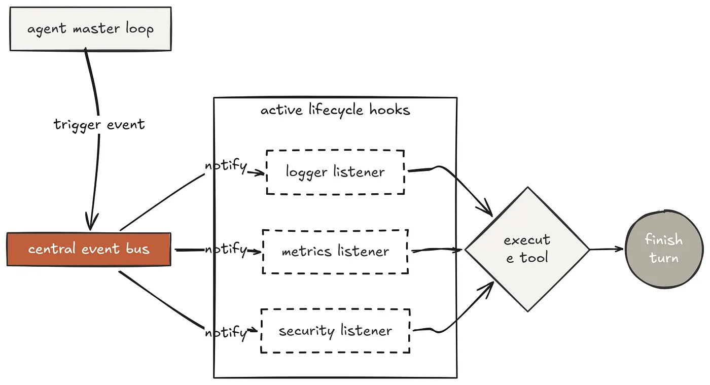

*事件匯流排*

```python
from collections import defaultdict
from datetime import datetime

class EventBus:
    def __init__(self):
        self._handlers = defaultdict(list)

    def on(self, event: str, handler) -> "EventBus":
        self._handlers[event].append(handler)
        return self

    def emit(self, event: str, **payload) -> list:
        results = []
        for handler in self._handlers[event]:
            try:
                result = handler(event=event, **payload)
                if result:
                    results.append(result)
            except Exception as e:
                print(f"\033[31m[EventBus] hook error on '{event}': {e}\033[0m")
        return results
```

**所有這些都在智能體循環本身內沒有任何可觀察性程式碼的情況下發生**——循環只觸發事件，鉤子決定如何處理它們。這正是 Claude Code 的鉤子架構分離關注點的方式。

---

### 對話持久化、恢復與分支

無法恢復的對話是無法信任長任務的對話。如果模型在複雜重構的 30 分鐘後終端關閉，一切都丟失了——不僅是對話，還有導致每個決定的推理上下文。

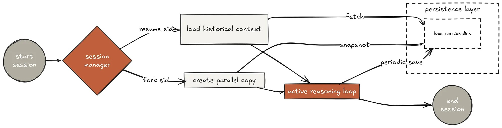

*對話持久化*

Claude Code 在你工作時本地存儲每條消息、工具呼叫和結果。三個 REPL 命令使持久化可操作：

| 命令 | 功能 |
|------|------|
| `:sessions` | 列出所有已保存的對話 |
| `:resume <id>` | 恢復現有對話 |
| `:fork <id>` | 從任何點分支而不影響原始對話 |

```
s17 >> :sessions
  a3f2c891  2026-04-01 11:23:45  Add error handling to run_write  (14 msgs)

s17 >> :resume a3f2c891
  Resumed: a3f2c891 - Add error handling to run_write (14 msgs)

s17 >> :fork a3f2c891
  Forked → b7e1d334
```

終端在對話中途關閉，然後完全恢復——14 條消息的上下文、完整的 todo 狀態、已完成工作的完整歷史。分支創建了一個獨立的分支，可以在不影響原始對話的情況下探索其他更改。Claude Code 原生提供了這種能力。

---

## 第五階段：高性能非同步執行時

第六階段關於性能和控制——智能體從正確到快速且可操控：用 `asyncio.gather` 將多工具輪次從順序折疊為並發，通過中斷注入為使用者提供即時操控，通過提示詞快取消除冗餘的 Token 支出，以及通過官方 MCP 執行時向任何外部伺服器開放工具登錄表。

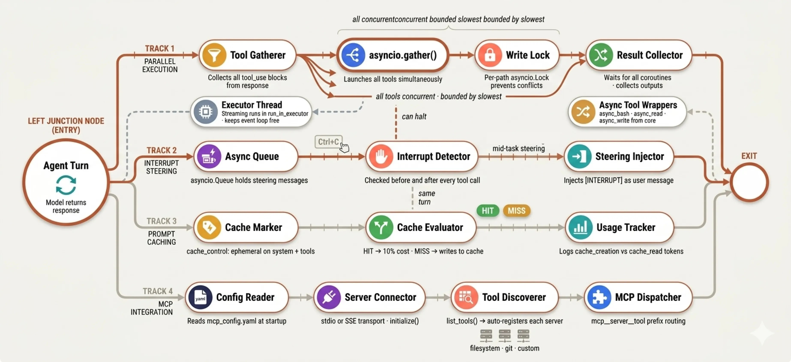

*高性能非同步執行時*

> 這是 Claude Code 的 92% 前綴重用率、並行工具執行和 MCP 支援被明確化和可測量的地方。

### 使用 asyncio.gather 並行工具執行

Claude Code 最顯著的性能特性之一（通過執行追蹤分析揭示）是它從不在不需要的時候順序執行工具呼叫。

1. 當 Claude 在單個輪次中返回帶有三個 grep 呼叫和兩次讀取的回應時，所有五個同時執行。輪次在最慢的單個呼叫時間內完成，而不是所有五個的總和。
2. 對於涉及數十次讀取和搜索的程式碼庫探索任務，這種差異會顯著複合。


*並行工具*

```python
import asyncio

async def _dispatch_one(block) -> tuple[str, str]:
    """非同步執行一個工具塊。"""
    inp  = block.input
    name = block.name
    handler = ASYNC_DISPATCH.get(name)
    if not handler:
        return block.id, f"Unknown tool: {name}"
    try:
        output = await handler(inp)
    except Exception as e:
        output = f"Error: {e}"
    return block.id, output

# 在智能體循環中：
pairs = await asyncio.gather(*[_dispatch_one(b) for b in tool_blocks])
```

三個 grep 同時執行，然後五次讀取和 bash 呼叫同時執行。模型一次接收所有結果，並在單個推理步驟中綜合它們。在順序執行中，這將是八個單獨的輪次。在並行中，它是兩個。

> 這在更大的程式碼庫上顯著複合，Claude Code 在寫入單行之前探索數十個檔案。

---

### 即時中斷注入

Claude Code 讓你在任務中途按 Ctrl+C 重新定向智能體，而不丟失它已完成的任何工作。智能體不崩潰，它讀取你的中斷，總結其當前進度，並等待新指令。

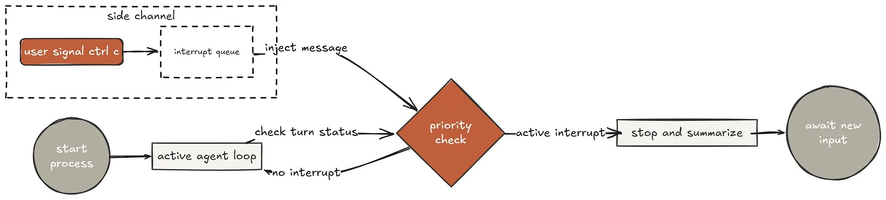

*即時中斷*

```python
interrupt_queue: asyncio.Queue = asyncio.Queue()

SYSTEM = (
    f"You are a coding agent at {os.getcwd()}. "
    "When you receive [INTERRUPT], stop immediately. "
    "Summarise exactly what you have completed so far, "
    "what you were working on, and what remains. "
    "Then wait for new instruction."
)
```

```
s19 >> Refactor every session file from s01 to s12 to add type annotations...

[read] agents/s01_agent_loop.py
[write] agents/s01_agent_loop.py
[write] agents/s02_tool_use.py
[read] agents/s03_todo_write.py
^C   ← 使用者按 Ctrl+C

[INTERRUPT] 使用者按 Ctrl+C. 停止當前任務。
I have completed type annotations for:
  ✓ s01_agent_loop.py (task 0)
  ✓ s02_tool_use.py   (task 1)
I was mid-way through s03_todo_write.py (task 2)...

s19 >> Actually skip s03 for now and jump straight to s04 through s06.
```

中斷到達，智能體乾淨地停止，精確地總結它做了什麼以及剩餘什麼，然後等待。然後使用者重新定向——跳過 s03，跳到 s04–s06。智能體繼續新指令而不丟失任何已完成的工作。這是 Claude Code 提供的互動模型——長任務保持可操控，而不是成為承諾。

---

### 提示詞快取與 KV 快取最佳化

逆向工程的 Claude Code 執行追蹤顯示所有內部智能體呼叫的 92% 提示詞前綴重用率。這不是偶然的——它是通過結構化每個提示詞使穩定內容先出現、可變內容最後出現的結果。

**Anthropic 提示詞快取以約 10% 的正常 Token 成本服務那些穩定前綴。** 對於在長對話中進行數百次 API 呼叫的智能體，這會複合成非常顯著的節省。

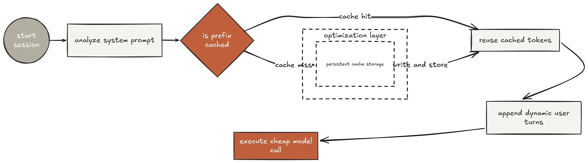

*KV 快取*

```python
SYSTEM_BLOCKS = [
    {
        "type": "text",
        "text": (
            f"You are a coding agent at {os.getcwd()}. "
            # ... 系統提示詞內容 ...
        ),
        "cache_control": {"type": "ephemeral"},  # ← 標記為可快取
    }
]
```

```
s20 >> Read every file in agents/ and produce a one-line summary...

[cache] MISS → 1,847 tokens written  ← 第一次呼叫建立快取
...
[cache] HIT → 1,847 tokens read (saved ~1,662 tokens)
...
[cache summary] 6 calls | written=1,847 | hits=5 |
                total saved≈8,310 tokens
```

第一次呼叫將 1,847 個 Token 寫入快取（系統提示詞和工具定義）。每次後續呼叫以 10% 的成本從快取服務那些相同的 Token。在 6 次呼叫中，節省了 8,310 個 Token。在進行數百次呼叫的完整 Claude Code 對話中，這個相同的機制產生了在執行追蹤中觀察到的 92% 前綴重用率。

---

### 官方 MCP 執行時整合

Claude Code 原生支援 MCP——任何兼容伺服器的工具都成為智能體工具登錄表中的一等公民。檔案系統伺服器添加檔案工具，git 伺服器添加 git 操作工具，資料庫伺服器添加查詢工具。模型呼叫所有這些工具與內置工具完全相同，無需意識到工具是本地 Python 函數還是遠端伺服器進程。

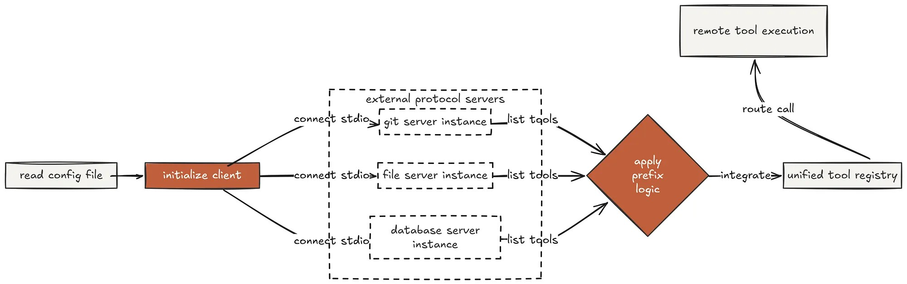

*MCP*

```python
from mcp import ClientSession, StdioServerParameters
from mcp.client.stdio import stdio_client

MCP_SESSIONS: dict[str, ClientSession] = {}
MCP_TOOL_MAP: dict[str, tuple[str, str]] = {}

async def connect_mcp_servers() -> list[dict]:
    """連接到所有配置的 MCP 伺服器，返回它們的工具作為 Anthropic 定義。"""
    # ... 連接邏輯
    for tool in tool_list.tools:
        prefixed = f"mcp__{name}__{tool.name}"
        MCP_TOOL_MAP[prefixed] = (name, tool.name)
        mcp_tools.append({
            "name":         prefixed,
            "description":  f"[{name}] {tool.description or tool.name}",
            "input_schema": tool.inputSchema or {"type": "object", "properties": {}},
        })
    return mcp_tools
```

```
s21 >> Using the connected filesystem and git MCP servers,
       show me the git log for the last 5 commits...

[MCP] connected: filesystem (8 tools)
[MCP] connected: git (6 tools)
Total tools: 14 built-in + 14 MCP = 28 available

[mcp__git__git_log] {"repo_path": ".", "max_count": 5}
commit a3f2c891  Add error handling to run_write (2026-04-01)
...
```

模型呼叫 `mcp__git__git_log`、`mcp__git__git_diff` 和 `mcp__filesystem__read_file` 的方式與呼叫 bash 或 grep 完全相同。MCP 前綴純粹是調度映射中的路由細節。從模型的角度來看，工具登錄表在伺服器啟動時連接後從 14 個工具增長到 28 個工具。

**這就是 Claude Code 的 MCP 支援的工作方式——外部伺服器透明地擴展工具登錄表，對智能體循環或模型的互動模式零更改。**

---

## 第六階段：企業級升級

**第七階段關於用生產級替代方案替換教學實現**——基於檔案的郵箱變成 Redis pub/sub 頻道，帶有即時傳遞和跨機器支援；基本 worktree 創建變成處理真實程式碼庫表面的每個邊緣情況的完整生命週期管理器；整個系統被組裝成一個可部署的參考，連接所有機制。

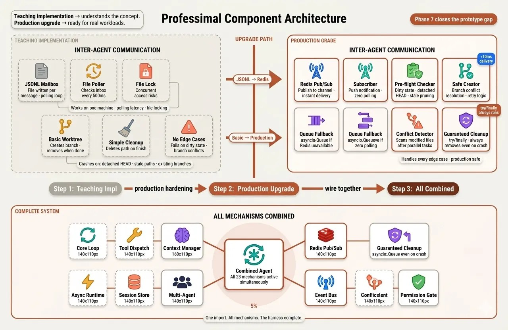

*企業級升級*

這是工作原型和可以在生產中運行的系統之間的差距縮小的地方。

### Redis Pub/Sub 生產郵箱

第四階段的 JSONL 郵箱系統作為教學機制有效，但有三個基本的生產問題。它需要輪詢——隊友按計時器檢查其收件箱檔案，在消息發送和接收之間引入人工延遲。它需要並發訪問的檔案鎖定——兩個智能體同時寫入同一個檔案會產生損壞的 JSONL。而且它是單機的——郵箱檔案存在於一個檔案系統上，使分布式部署不可能。


*Redis Pub/Sub*

Claude Code 的內部智能體協調使用即時、無鎖且跨進程邊界工作的消息傳遞。Redis pub/sub 提供了這些屬性。智能體發佈到頻道，任何訂閱者都在毫秒內收到它——無輪詢循環、無檔案鎖定、無檔案系統依賴。

實現將兩個後端封裝在公共介面後面，因此第四階段的隊友和主智能體邏輯完全不變：

```python
import redis.asyncio as aioredis

class MailboxBackend:
    """公共介面——在不改變智能體邏輯的情況下交換後端。"""
    async def send(self, to: str, message: dict): ...
    async def receive(self, name: str, timeout: float = 30.0) -> dict | None: ...
    async def close(self): ...

class RedisMailbox(MailboxBackend):
    """生產後端——即時傳遞、跨機器、無輪詢。"""

    def __init__(self, redis_url: str):
        self.redis   = aioredis.from_url(redis_url, decode_responses=True)
        self._pubsubs: dict[str, aioredis.client.PubSub] = {}

    async def send(self, to: str, message: dict):
        payload = json.dumps({**message, "ts": datetime.now().isoformat()})
        await self.redis.publish(self._channel(to), payload)

class QueueMailbox(MailboxBackend):
    """回退後端——當 Redis 不可用時，進程內的 asyncio.Queue。"""
    # ...

async def make_mailbox() -> MailboxBackend:
    """如果可用使用 Redis，否則回退到 Queue。"""
    try:
        mb = RedisMailbox(redis_url)
        await mb.redis.ping()
        return mb
    except Exception as e:
        return QueueMailbox()
```

延遲差異在輸出中可見——Redis 在 10 毫秒以下傳遞消息，相比第四階段 JSONL 方法的 500 毫秒輪詢間隔。更重要的是，Redis 後端無論兩個智能體是在同一台機器還是集群中的不同機器上運行都能以相同方式工作——JSONL 方法根本無法做到這一點。

---

### 進階 Worktree 生命週期管理

第四階段的基本 worktree 實現創建和刪除 worktree，但在生產使用中出現的每個邊緣情況上靜默失敗。

**一個已從崩潰的先前執行中存在的分支會導致 `git worktree add` 失敗。** 生產 worktree 管理器在任何任務執行開始之前系統地處理每個邊緣情況。

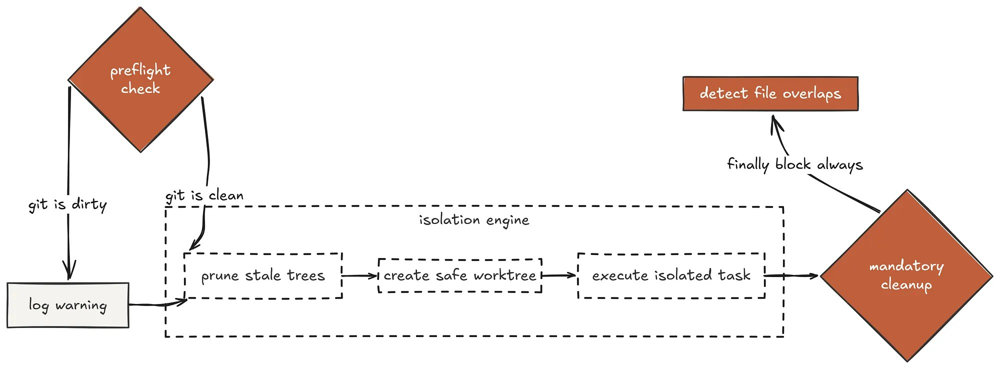

*Worktree 生命週期*

```python
def check_git_state() -> dict:
    """在任何 worktree 操作之前的完整飛行前檢查。"""
    _, branch, _ = _git("symbolic-ref", "--short", "HEAD")
    _, dirty, _  = _git("status", "--porcelain")
    _, wt_list, _ = _git("worktree", "list", "--porcelain")
    return {
        "branch":        branch or "(detached)",
        "is_dirty":      bool(dirty),
        "is_detached":   not branch,
        "worktree_count": wt_list.count("worktree "),
    }

def create_worktree_safe(task_id: str) -> tuple[str, str]:
    """
    帶有完整邊緣情況處理的安全 worktree 創建。
    返回 (path, branch) 或帶有清晰消息的 RuntimeError。
    """
    state = check_git_state()

    if state["is_detached"]:
        raise RuntimeError(
            "Repository is in detached HEAD state. "
            "Run 'git checkout main' before creating worktrees."
        )
    # ... 更多邊緣情況處理
```

```
s23 >> Run two tasks in parallel isolated worktrees:
       Task A: Add input validation to run_bash
       Task B: Add a call counter to run_bash

Pre-flight check:
  Branch: main | Dirty: no | Worktrees: 1 (main only)
  Pruned: 0 stale worktrees
  [worktree] created: .worktree-task-a1b2
  [worktree] created: .worktree-task-e5f6

  Running 2 tasks in parallel...
  [a1b2c3][bash] python -m pytest tests/ -q → 44 passed
  [e5f6a7][bash] python -m pytest tests/ -q → 44 passed

  Conflict detection:
  Tasks a1b2c3d4 and e5f6a7b8 both modified: agents/core.py
  Overlap on 1 file - human review required before merging.
```

飛行前檢查在創建任何 worktree 之前執行。兩個任務在隔離目錄中完全並行執行。衝突檢測器在兩個完成後執行，正確識別出重疊。分支被保留而不是刪除，以便合併可以有意地完成。這是生產級 worktree 管理——每個邊緣情況被處理，每個失敗模式被考慮，無論執行期間發生什麼，都保證清理。

---

### 所有機制的組合

通過實現二十三個單獨的對話，這個檔案回答了每個工程師在閱讀各個階段後都會問的問題：當它們全部同時執行時是什麼樣子？

組合檔案將第二至第四階段的每個機制與第一階段的共享基礎連接在一起——todo 規劃、任務圖依賴追蹤、子智能體上下文隔離、按需技能載入、三層上下文壓縮、後台任務執行、持久智能體團隊、FSM 通訊協定和 git worktree 隔離，全部同時活躍。

我創建的檔案有 280 行，因為 `core.py` 處理所有共享的內容。每個機制只貢獻其獨特的邏輯：

```python
from core import (
    client, MODEL, DEFAULT_SYSTEM,
    EXTENDED_TOOLS, EXTENDED_DISPATCH,
    # ... 更多導入
)

ALL_DISPATCH = {
    **EXTENDED_DISPATCH,
    "todo_write":       lambda i: todo_write(i["tasks"]),
    "todo_read":        lambda i: todo_read(),
    "todo_update":      lambda i: todo_update(i["index"], i["status"]),
    "spawn_subagent":   lambda i: spawn_subagent(i["prompt"]),
    "list_skills":      lambda i: list_skills(),
    "load_skill":       lambda i: load_skill(i["name"]),
    # ... 更多工具
}
```

每個機制都貢獻了可見的東西：技能載入塑造了調試方法，子智能體隔離處理了 JSON 分析而不污染主上下文，後台執行在智能體寫新測試時運行測試套件，上下文壓縮在對話變大時自動觸發。

---

## 如何進一步改進

到目前為止，我們已經從最小智能體循環一直構建到具有串流、並行執行、提示詞快取、Redis 郵箱、權限治理、對話持久化和官方 MCP 執行時的生產級多智能體系統。

架構是清晰、非重複且完全測試的。仍然有改進的空間：

1. **並行子智能體生成**——當前的子智能體實現是順序的。將 `spawn_subagent` 重構為使用 `asyncio.gather` 將允許主智能體同時分發三個探索子智能體，與 Claude Code 內部的做法完全相同，通過並行智能體的數量縮短探索時間。

2. **向量記憶存儲**——我們的長期記憶是一個平面 Markdown 檔案。用像 ChromaDB 這樣的輕量級向量存儲替換它，將允許智能體取回語義相關的記憶，而不是在每個對話中注入整個摘要，隨著項目增長保持上下文專注。

3. **細粒度 Token 核算**——快取統計追蹤器計算每個對話的 Token，但不按任務或工具類型細分成本。添加每個操作記錄支出的成本帳本，將讓團隊識別哪些工具呼叫最昂貴並相應優化。

4. **基於 Webhook 的事件匯流排**——事件匯流排只在進程內觸發鉤子。將其擴展為將事件轉發到外部 HTTP 端點，將允許與 Slack、Datadog、PagerDuty 或任何監控系統集成，而無需修改智能體循環。

5. **評估框架**——測試套件驗證 Harness 正確工作，但不衡量智能體在真實任務上的表現。添加一個 LLM 作為評判者的評估層，對智能體在準確性、工具效率和計劃遵循方面的輸出進行評分，將把儲存庫變成一個可基準測試的系統，而不僅僅是一個工作系統。

---

> 如果你覺得這篇文章有用，可以在 Medium 上關注作者。